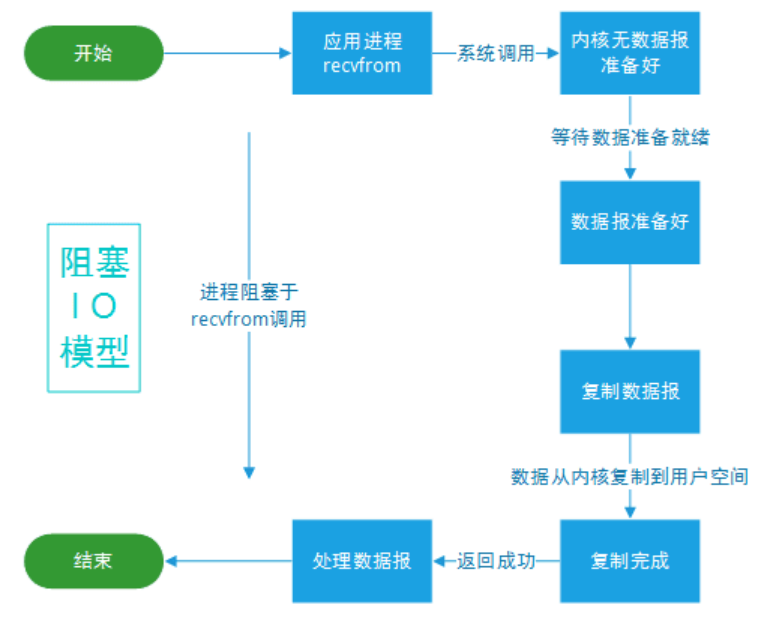
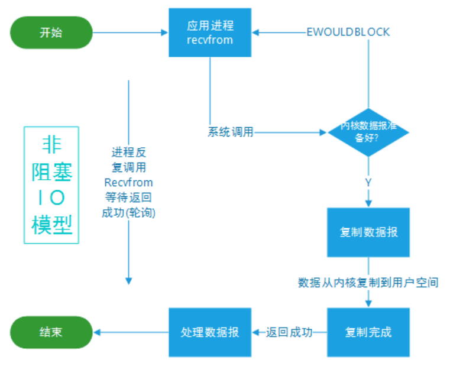
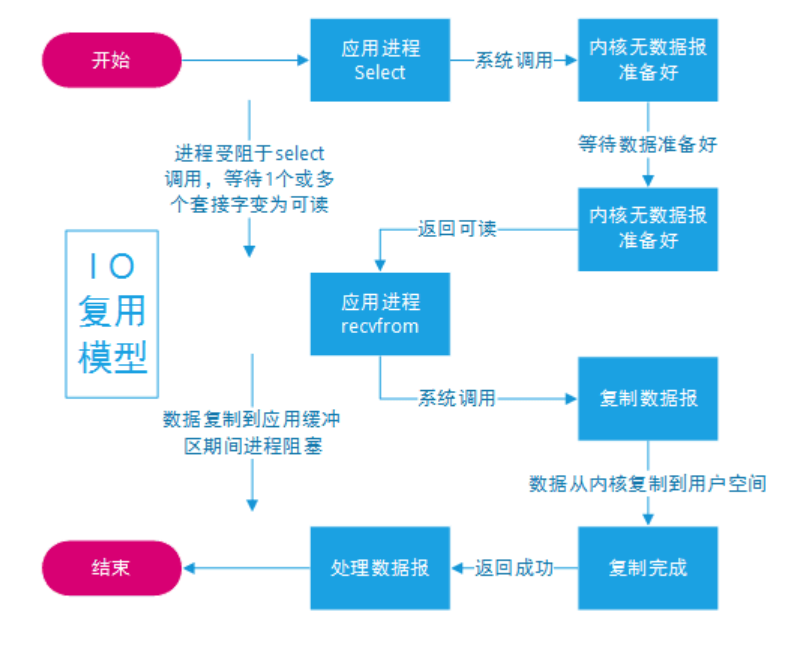
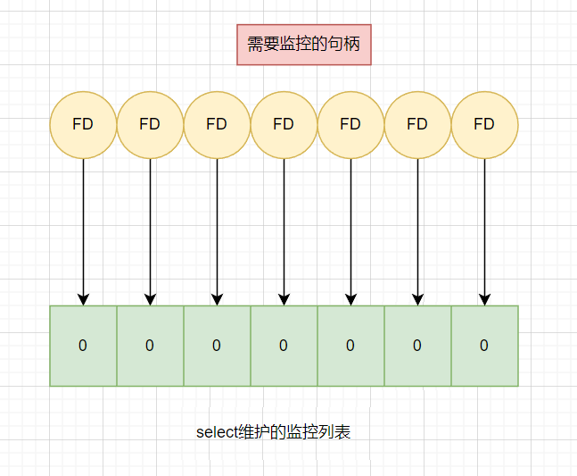
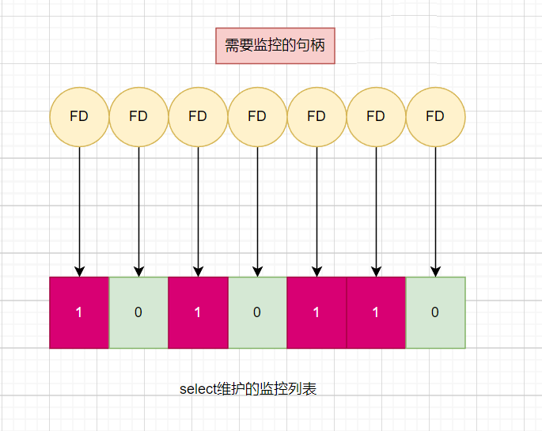
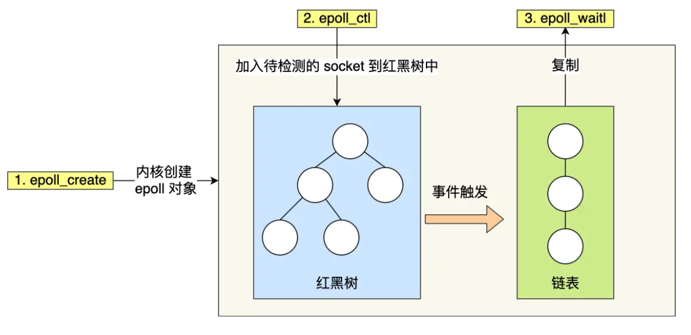

# Linux的IO模型

前言：IO指的是什么？什么是阻塞和非阻塞？什么是同步和异步？什么是IO多路复用?什么是事件驱动型IO？Linux下的select、poll、epoll是什么？希望大家通过本文有个了解

### IO是什么？

IO在计算机中指Input/Output，也就是输入和输出。常见的：数据读取、网络访问都是IO。

### 阻塞和非阻塞

阻塞：在调用结果返回前，当前线程会被挂起，并在得到结果之后返回。

举例：食堂排队打饭，饭一直没来，就一直排队等饭来，期间不干其他事情。

非阻塞：如果不能立刻得到结果，则该调用者不会阻塞当前线程。因此对应非阻塞的情况，调用者需要定时轮询查看处理状态。

举例：食堂打饭，饭没来，就先玩一会手机，听会歌，过一会再看饭来没得。

### 同步和异步

同步：执行程序如果没收到响应，就一直等下去

举例：去食堂打饭，如果一直没打到饭，就一直等饭来

异步：程序执行时无需等待，继续执行接下来的操作，有响应时系统会通知

举例：去食堂打饭，饭没来，就去干其他事情；如果食堂饭来了，会有人来通知你去拿饭

### IO模型介绍

一共有5种IO模型：

- 阻塞式 I/O
- 非阻塞式 I/O
- I/O 复用(select 、poll、epoll)
- 异步 I/O(AIO)
- 信号驱动式 I/O(SIGIO)

#### 阻塞式 I/O

当前进程被阻塞，其他程序还是正常运行的，此时不消耗CPU时间，单个执行效率高。



缺点：浪费性能，因为被阻塞的进程什么也干不了。

单线程同步阻塞IO：

```
// 伪代码描述
while (true) {
	// accept阻塞
    client_fd = accept(listen_fd);
    fds.append(client_fd);
    for (fd in fds) {
    	// recv阻塞（会影响上面的accept）
        if (recv(fd)) {
        	// logic
        }
    }
}
```

多线程同步阻塞IO

```
// 伪代码描述
while(true) {
  // accept阻塞
  client_fd = accept(listen_fd)
  // 开启线程read数据（fd增多导致线程数增多）
  new Thread func() {
    // recv阻塞（多线程不影响上面的accept）
    if (recv(fd)) {
      // logic
    }
  }  
}
```

每一个accept请求都需要开一个线程处理，浪费系统资源，属于换汤不换药的优化。

#### 非阻塞式 I/O

如果内核数据还没准备好，可以先返回错误信息给用户进程，让它不需要等待，而是通过轮询的方式再来请求。



缺点：一直轮询导致CPU要处理更多系统调用，效率是比较低的。

```
// 伪代码描述
while(true) {
  // accept非阻塞（cpu一直忙轮询）
  client_fd = accept(listen_fd)
  fds.append(client_fd)
  for (fd in fds) {
    // recv非阻塞
    setNonblocking(client_fd)
    // recv 为非阻塞命令
    if (len = recv(fd) && len > 0) {
      // 有读写数据
      // logic
    } else {
       无读写数据
    }
  }  
}
```

虽然相比阻塞IO提升了性能，但是依然存在性能问题，轮询导致很多性能浪费。

#### I/O 复用

使用系统提供的函数：select(windows、linux) 、poll(windows、linux)、epoll(linux)，利用操作系统监控IO操作，如果内核数据就绪，应用进程就发起调用



```
// 伪代码描述
while(true) {
  // 通过内核获取有读写事件发生的fd，只要有一个则返回，无则阻塞
  // 整个过程只在调用select、poll、epoll这些调用的时候才会阻塞，accept/recv是不会阻塞
  for (fd in select(fds)) {
    if (fd == listen_fd) {
        client_fd = accept(listen_fd)
        fds.append(client_fd)
    } elseif (len = recv(fd) && len != -1) { 
      // logic
    }
  }  
}
```

##### select

select函数在windows和linux都支持，其原理是，将监控的句柄放到内核空间监控列表中，最大1024，初始状态都为0



如果监控的句柄就绪，就修改为1，同时从内核空间拷贝到用户空间，让程序遍历读取这个列表



那么，当前图片的列表就是[1,0,1,0,1,1,0],此时还剩下3个需要继续监控。这一次列表遍历的代价是O(n)
。所以select的IO复用其实还比较低效，不仅有2次拷贝，而且仅支持最大1024个句柄监控，程序还需要完整遍历一次才能处理就绪的句柄。

select代码：

```
int main() {
  /*
   * 这里进行一些初始化的设置，
   * 包括socket建立，地址的设置等,
   */

  fd_set read_fs, write_fs;
  struct timeval timeout;
  int max = 0;  // 用于记录最大的fd，在轮询中时刻更新即可

  // 初始化比特位
  FD_ZERO(&read_fs);
  FD_ZERO(&write_fs);

  int nfds = 0; // 记录就绪的事件，可以减少遍历的次数
  while (1) {
    // 阻塞获取
    // 每次需要把fd从用户态拷贝到内核态
    nfds = select(max + 1, &read_fd, &write_fd, NULL, &timeout);
    // 每次需要遍历所有fd，判断有无读写事件发生
    for (int i = 0; i <= max && nfds; ++i) {
      if (i == listenfd) {
         --nfds;
         // 这里处理accept事件
         FD_SET(i, &read_fd);//将客户端socket加入到集合中
      }
      if (FD_ISSET(i, &read_fd)) {
        --nfds;
        // 这里处理read事件
      }
      if (FD_ISSET(i, &write_fd)) {
         --nfds;
        // 这里处理write事件
      }
    }
  }
```

##### poll

poll函数就是改进了select的一些缺点，比如使用动态数组，突破了1024的限制。

poll代码

```
// 先宏定义长度
#define MAX_POLLFD_LEN 4096  

int main() {
  /*
   * 在这里进行一些初始化的操作，
   * 比如初始化数据和socket等。
   */

  int nfds = 0;
  pollfd fds[MAX_POLLFD_LEN];
  memset(fds, 0, sizeof(fds));
  fds[0].fd = listenfd;
  fds[0].events = POLLRDNORM;
  int max  = 0;  // 队列的实际长度，是一个随时更新的，也可以自定义其他的
  int timeout = 0;

  int current_size = max;
  while (1) {
    // 阻塞获取
    // 每次需要把fd从用户态拷贝到内核态
    nfds = poll(fds, max+1, timeout);
    if (fds[0].revents & POLLRDNORM) {
        // 这里处理accept事件
        connfd = accept(listenfd);
        //将新的描述符添加到读描述符集合中
    }
    // 每次需要遍历所有fd，判断有无读写事件发生
    for (int i = 1; i < max; ++i) {     
      if (fds[i].revents & POLLRDNORM) { 
         sockfd = fds[i].fd
         if ((n = read(sockfd, buf, MAXLINE)) <= 0) {
            // 这里处理read事件
            if (n == 0) {
                close(sockfd);
                fds[i].fd = -1;
            }
         } else {
             // 这里处理write事件     
         }
         if (--nfds <= 0) {
            break;       
         }   
      }
    }
  }
```

##### epoll

epoll解决了上面两个函数的问题。在内核空间用红黑树来监控句柄，增加句柄和删除句柄复杂度为O(logn)
，只需要传入待监控的句柄，减少了内核空间和用户空间的数据交换。使用事件驱动机制，内核里维护了一个链表来记录就绪的句柄，用户只需要遍历这个链表即可获取就绪句柄。



epoll代码

```
int s = socket(AF_INET, SOCK_STREAM, 0);
bind(s, ...);
listen(s, ...)

int epfd = epoll_create(...);
epoll_ctl(epfd, ...); //将所有需要监听的socket添加到epfd中

while(1) {
    int n = epoll_wait(...);//epoll_wait有数据就返回链表
    for(接收到数据的socket){
        //处理
    }
}
```

同时，epoll还分水平触发和边缘触发。以下简单描述下

水平触发：如果快递箱发现你的快递没有被取出，它就会不停地发短信通知你，直到你取出了快递，它才消停

边缘触发：你的快递被放到了一个快递箱里，如果快递箱只会通过短信通知你一次，即使你一直没有去取，它也不会再发送第二条短信提醒你

epoll默认水平触发，虽然边缘触发性能好，但是处理不好容易出现漏数据的情况，一般不采用。

参考：

https://pdai.tech/md/java/io/java-io-model.html

https://juejin.cn/post/6882984260672847879

https://juejin.cn/post/6844904200141438984

https://xiaolincoding.com/os/8_network_system/selete_poll_epoll.html#epoll