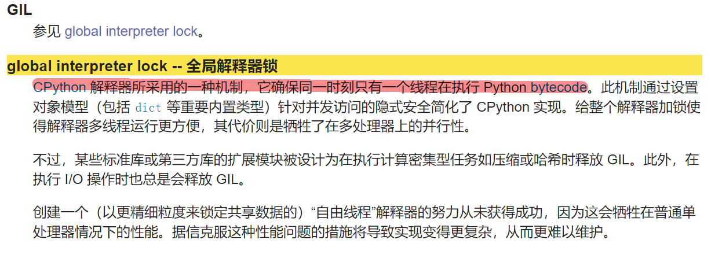
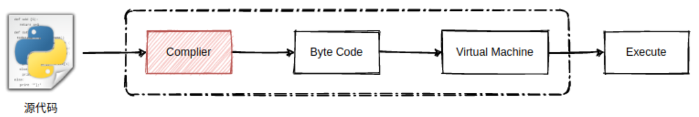

# python的全局解释器锁GIL

[TOC]

## GIL官方解释

**1.GIL叫做全局解释器锁，解释器是什么？**

python代码其实是运行在虚拟机上的，.py文件是先编译生成字节码，然后由虚拟机进行执行。所以解释器其实有2部分组成：编译器和虚拟机。

**2.在解释器执行python代码时，保证只有一个线程在执行python字节码**

这种机制使得python内置的对象模型，如dict,list本身就是并发安全型的容器。如果在多线程下运行解释器，执行顺序如下：

1. 设置GIL
2. 切换到一个线程去运行
3. 运行： a. 指定数量的字节码指令，或者

   ​ b. 线程主动让出控制（可以调用time.sleep(0)）

4. 把线程设置为睡眠状态
5. 解锁GIL
6. 再次重复以上所有步骤

**3.在执行IO操作时，会释放GIL**

这也是为什么说，python的多线程在IO密集型操作下，仍然是高效有用的。

**4.那为什么有了GIL，我们在讲多线程时，还是会讲锁的概念呢？**

GIL是宏观上的锁，是用于解释器执行代码的锁。我们操作线程时，讲的锁，是微观上的锁。针对资源访问出现竞争时，使用的锁。python的线程模型是按照java实现的，可以去看看java的线程模型，有更深的学习。

**5.GIL原理**

由于 Python 的线程就是 C 语言的 pthread，它是通过操作系统调度算法调度执行的。

Python 2.x 的代码执行是基于 opcode 数量的调度方式，简单来说就是每执行一定数量的字节码，或遇到系统 IO 时，会强制释放 GIL，然后触发一次操作系统的线程调度。

虽然在 Python 3.x 进行了优化，基于固定时间的调度方式，就是每执行固定时间的字节码，或遇到系统 IO 时，强制释放 GIL，触发系统的线程调度。

但这种线程的调度方式，都会导致同一时刻只有一个线程在运行。

而线程在调度时，又依赖系统的 CPU 环境，也就是在单核 CPU 或多核 CPU 下，多线程在调度切换时的成本是不同的。

**6.那去掉GIL不就行了？**

由于历史原因，目前cpython还是有GIL的，其他语言实现的python解释器可能没有GIL的限制。曾经也有人尝试过，去掉GIL，但是效果还没带GIL好。期待python真正去掉GIL的那天，可能会再掀起编程语言的新浪潮！

## 参考

1.https://smartkeyerror.com/Python-Virtual-Machine

2.https://www.cnblogs.com/swearBM/p/9244011.html

3.https://cloud.tencent.com/developer/news/743497