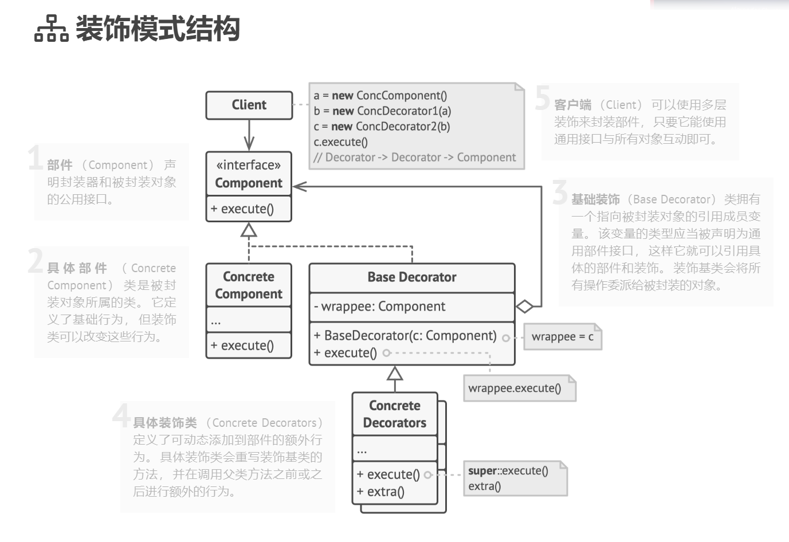

# 搞定python装饰器

前言：什么是装饰器？他的作用是什么?python装饰器如何写？

[TOC]

## 装饰器及其作用

装饰器模式（Decorator Pattern）允许向一个现有的对象添加新的功能，同时又不改变其结构。这种类型的设计模式属于结构型模式，它是作为现有的类的一个包装。

这种模式创建了一个装饰类，用来包装原有的类，并在保持类方法签名完整性的前提下，提供了额外的功能。



我们用标准的装饰器设计模式代码实现看看

```python
# -*- coding:utf-8 -*-

from abc import ABC, abstractmethod


class Coffee(ABC):

    @abstractmethod
    def make_coffee(self):
        pass


class OriginalCoffee(Coffee):

    def make_coffee(self):
        print("原味咖啡！")


class CoffeeDecorator(Coffee):
    def __init__(self, coffee: Coffee):
        self._coffee = coffee

    def make_coffee(self):
        self._coffee.make_coffee()


class MilkDecorator(CoffeeDecorator):
    def make_coffee(self):
        super().make_coffee()
        self._add_milk()

    def _add_milk(self):
        print('加牛奶！')


class SugarDecorator(CoffeeDecorator):
    def make_coffee(self):
        super().make_coffee()
        self._add_sugar()

    def _add_sugar(self):
        print('加糖！')


if __name__ == '__main__':
    coffee = OriginalCoffee()
    coffee.make_coffee()
    print('-' * 10)
    coffee = MilkDecorator(coffee)
    coffee.make_coffee()
    print('-' * 10)
    coffee = SugarDecorator(coffee)
    coffee.make_coffee()

    
打印结果：
原味咖啡！
----------
原味咖啡！
加牛奶！
----------
原味咖啡！
加牛奶！
加糖！
```

我们的原味咖啡，被装饰后，添加了牛奶和糖，这就是按照装饰器模式UML图实现的装饰器模式。

## python的装饰器

在python中，我们一般不这样写装饰器，更常见的是以@语法糖来进行装饰。先看一个最简单的装饰器。

```python
# -*- coding:utf-8 -*-
import time


def f_timer(f):
    def my_func():
        start = time.time()
        f()
        print(time.time() - start)

    return my_func


@f_timer
def func():
    print('hello')
    time.sleep(1)
    print('world')


if __name__ == '__main__':
    func()
    
打印结果：
hello
world
1.0009925365447998

```

@f_timer装饰func()函数，在func()执行完成后打印函数执行时间。f_timer()这个函数的入参f，其实是一个函数对象。那如果我们的装饰器需要携带参数，该怎么写呢？

```python
# -*- coding:utf-8 -*-
import time


def f_timer(f):
    # 可以看到，我们的参数是在my_func这个函数传递的
    def my_func(a, b):
        start = time.time()
        f(a, b)
        print(time.time() - start)

    return my_func


@f_timer
def func(a, b):
    print(a)
    time.sleep(1)
    print(b)


if __name__ == '__main__':
    func('hello', 'world')

```

那如果我的func()是有返回值的，该怎么写呢？

```python
# -*- coding:utf-8 -*-
import time


def f_timer(f):
    # 可以看到，我们的参数是在my_func这个函数传递的
    def my_func(a, b):
        start = time.time()
        # 我们是在这里获取返回值
        res = f(a, b)
        print(f'函数执行时间：{time.time() - start}')
        # 这里return函数f的返回值
        return res

    return my_func


@f_timer
def func(a, b):
    return a + b


if __name__ == '__main__':
    print(func('hello', 'world'))


打印结果：
函数执行时间：0.0
helloworld

```

## python装饰器的万能公式

```python
基本
@decorator
def func():
    return a + b

函数携带参数
@decorator
def func(a, b):
    return a + b

装饰器携带参数
@decorator(x,y)
def func(a, b):
    return a + b
```

万能公式：func=decorator(func)，这个是最基本的形式，根据这个公式，我们可以推出函数携带参数的装饰形式为func=decorator(func(a,b))；func=decorator(x,y)(func(a,b))

通用无参数装饰器函数

```python
# -*- coding:utf-8 -*-

def decorator(func):
    """
    通用无参数装饰器函数
    :param func: 函数名
    :return:
    """

    def my_func(*args, **kwargs):
        # 添加装饰逻辑
        # res为func的返回值
        res = func(*args, **kwargs)
        # 添加装饰逻辑
        return res

    return my_func

@decorator
def func():
    pass
```

通用带参数装饰器函数

```python
# -*- coding:utf-8 -*-

def decorator(*args, **kwargs):
    """
    通用带参数装饰器函数
    :param args: 
    :param kwargs:
    :return:
    """

    def decorator_func(func):
        def my_func(*args, **kwargs):
            # 添加装饰逻辑
            # res为func的返回值
            res = func(*args, **kwargs)
            # 添加装饰逻辑
            return res

        return decorator_func

    return decorator


@decorator(x, y)
def func():
    pass

```

平时还会遇到多个装饰器装饰一个函数的场景，那么装饰器的执行顺序就按照就近原则依次执行，下面的例子，可以看到先执行了log装饰器，再执行的f_timer装饰器

```python
# -*- coding:utf-8 -*-
import time


def log(f):
    def my_func():
        print('记录开始日志')
        f()
        print('记录结束日志！')

    return my_func


def f_timer(f):
    # 可以看到，我们的参数是在my_func这个函数传递的
    def my_func():
        start = time.time()
        f()
        print(f'函数执行时间：{time.time() - start}')

    return my_func


@f_timer
@log
def func():
    time.sleep(1)
    print('hello world')


if __name__ == '__main__':
    func()


打印结果：
记录开始日志
hello world
记录结束日志！
函数执行时间：1.0001060962677002
```

## python类装饰

python中除了可以用函数装饰器，还可以用类装饰器。

```python
# -*- coding:utf-8 -*-
class Decorator:
    def __init__(self, func):
        self.func = func

    def __call__(self, *args, **kwargs):
        print('添加装饰！')
        res = self.func(*args, **kwargs)
        print('添加装饰！')
        return res


@Decorator
def func():
    print('hello world')


if __name__ == '__main__':
    func()

    
打印结果：
添加装饰！
hello world
添加装饰！
```

通过重写类的\__call__方法，可以实现f()的调用方式执行代码，从而实现我们的装饰器。但是一般不建议这样写类装饰器。

```python
# -*- coding:utf-8 -*-
import time


class Decorator:

    @staticmethod
    def f_timer(f):
        # 可以看到，我们的参数是在my_func这个函数传递的
        def my_func():
            start = time.time()
            f()
            print(f'函数执行时间:{time.time() - start}')

        return my_func


@Decorator.f_timer
def func():
    time.sleep(1)
    print('hello world')


if __name__ == '__main__':
    func()

    
打印结果:
hello world
函数执行时间:1.0005874633789062
```

我们使用@staticmethod方法写一个类的静态方法，然后可以看到f_timer这个装饰器和我们之前的装饰器写法是一样，那么就可以通过这个类的管理我们的装饰器了。