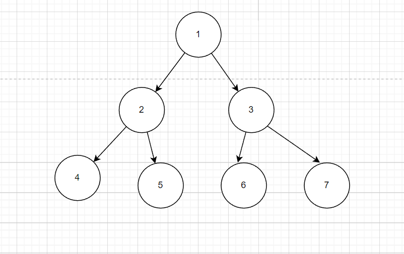
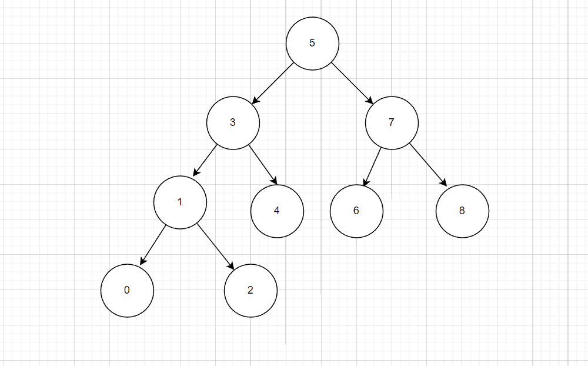
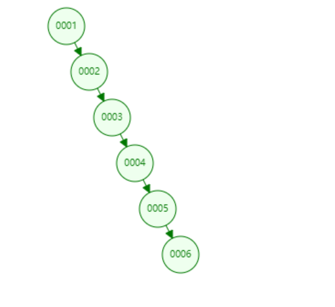
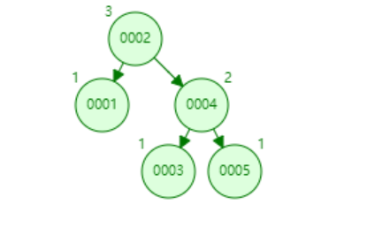
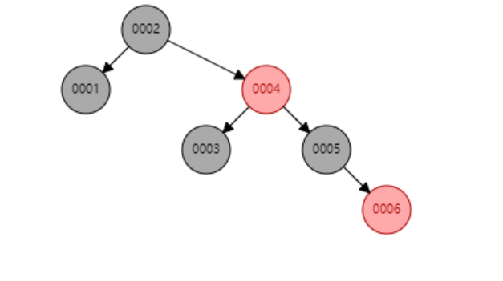
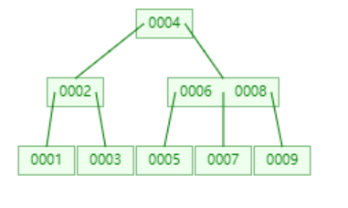
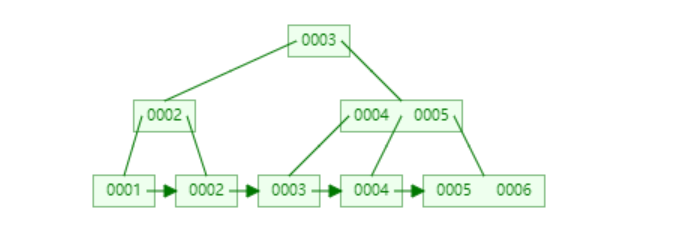

# 红黑树、B树、B+树是什么？

**前言：**平时经常看网上写，红黑树、B树、B+树，那这些数据结构到底是什么样的呢？都是用于解决什么问题的呢？在哪些地方应用呢？让我们通过本文一起学习这些高级数据结构的奥秘。

[TOC]

## 二叉树

定义：树中节点的度不大于2的有序树

二叉树比较简单，就不展开讲了，详细资料可以看参考。

## 二叉搜索树

定义：左子树上所有结点的值均小于它的根结点的值，右子树上所有结点的值均大于它的根结点的值。

二叉搜索树，那肯定用于搜索方便嘛；比如我们需要搜索2这个节点，2比5小，那么肯定在左子树，2又比3小，在3的左子树，2又比1大，再1的右子树，那么就搜到了2，时间复杂度O(logn)。不过这个二叉搜索树也有缺点，如下图

当我们的二叉搜索树，是这样的排列，就退化成线性数据结构了，也就说查找的时间复杂度为O(n)了，所以二叉搜索树还是有一定的局限，插入数据的不能是顺序的。

## AVL平衡树

定义：自平衡二叉查找树。在AVL树中任何节点的两个子树的高度最大差别为1。增加和删除可能需要通过一次或多次树旋转来重新平衡这个树。

我们输入[1,2,3,4,5]构造的一棵AVL树，如下图，可以看出来，他的根节点并不是1

AVL树解决了二叉搜索树退化成线性结构的问题，并且查找、插入的时间复杂度都是O(logn)，删除为O(2logn)。但是由定义可知，他是通过多次旋转节点才达到的平衡，而且由于旋转过于复杂，实现起来是很复杂的。

## 红黑树

定义：

1.结点是红色或黑色。

2.根结点是黑色。

3.所有叶子都是黑色。（叶子是NIL结点)

4.每个红色结点的两个子结点都是黑色。（从每个叶子到根的所有路径上不能有两个连续的红色结点）

5.从任一结点到其每个叶子的所有路径都包含相同数目的黑色结点。

说实话，红黑树的定义确实很复杂。下图是从[1,2,3,4,5,6]输入构造的红黑树，可以看出，他也是一棵二叉搜索，所以查找的时间复杂度为O(logn)。

那这么复杂的定义，是为了解决什么问题呢？红黑树通过牺牲插入和删除的代价，换取了稳定的查找时间，最坏的情况也可以达到O(logn)。同时红色树在解决不平衡问题上，仅在3次旋转内就可以解决。实际上插入 AVL
树和红黑树的速度取决于你所插入的数据.如果你的数据分布较好,则比较宜于采用 AVL树(例如随机产生系列数),但是如果你想处理比较杂乱的情况,则红黑树是比较快的。所以，红黑树广泛应用于：HashMap、TreeMap、linux的epoll

## B树

定义：B树属于多叉树又名平衡多路查找树（查找路径不止两个）

- 每个节点最多有m-1个**关键字**（可以存有的键值对）。

- 根节点最少可以只有1个**关键字**。

- 非根节点至少有m/2个**关键字**。

- 每个节点中的关键字都按照从小到大的顺序排列，每个关键字的左子树中的所有关键字都小于它，而右子树中的所有关键字都大于它。

- 所有叶子节点都位于同一层，或者说根节点到每个叶子节点的长度都相同。

- 每个节点都存有索引和数据，也就是对应的key和value。

  

看的出来B树定义是特别繁琐的哈。比如我们要查找20这个节点，20比30小，在左边查找，20比18大比22小，在22节点下查找，然后查到20这个节点。这里直接给出结论：树的高度H=logn，查找时间复杂度为O(logn)。

## B+树

定义：

B+树是B树的变体，其定义基本和特性与B-树同，除了：

1.非叶子结点的子树指针与关键字个数相同。

2.非叶子结点的子树指针P[i]，指向关键字值属于[K[i], K[i+1]]的子树（B-树是开区间）（下边的动图示例是遵循的开区间生成的，当然也算符合条件，但明显就不是最优的结构）。

3.为所有叶子结点增加一个链指针。

4.所有关键字都在叶子结点出现。

那么问题来了，这两个B到底做什么用呢？参考[B站视频详解](https://www.bilibili.com/video/BV1rB4y1Q7e6/?share_source=copy_web&vd_source=5986707a0fb9ea8fe32bb184c782664c)

MongoDB就是典型的B树应用

Mysql的InnoDB就是B+树的应用，还有我们的磁盘读取也是B+树应用

###### 参考：

数据结构可视化：

https://www.cs.usfca.edu/~galles/visualization/Algorithms.html

博客园：

https://blog.csdn.net/wanderlustLee/article/details/81297253

Infoq:

https://www.infoq.cn/article/xbzme1oqnkicaywiubrc

segmentfault：

https://segmentfault.com/a/1190000020416577

腾讯云：

https://cloud.tencent.com/developer/article/1691641

哔哩哔哩

【终于把B树搞明白了(二)_
什么是B树，B树的特点】 https://www.bilibili.com/video/BV1rB4y1Q7e6/?share_source=copy_web&vd_source=5986707a0fb9ea8fe32bb184c782664c