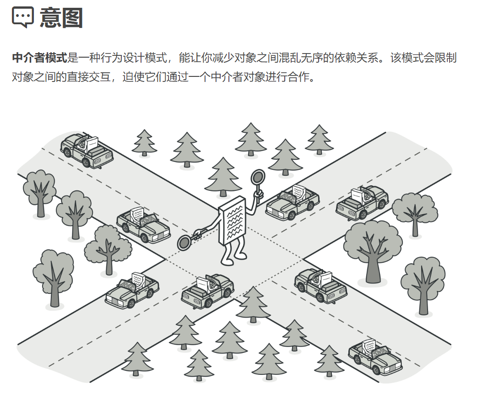
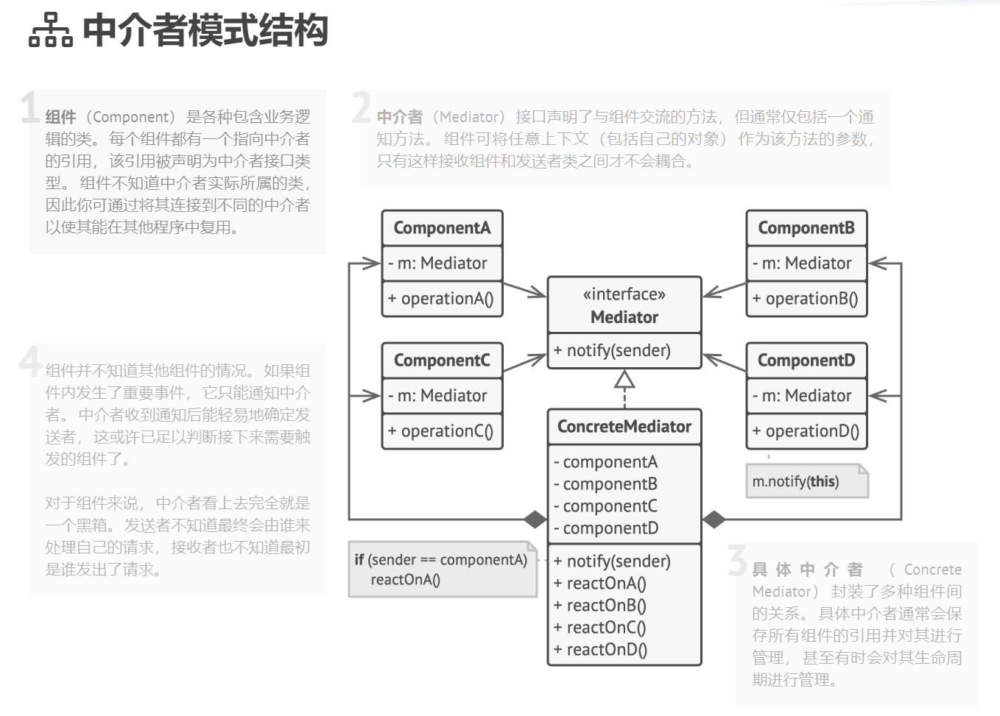

## 行为型模式（Behavioral Patterns）

### 中介者模式（Mediator Pattern）难度：3星

参考：https://refactoringguru.cn/design-patterns/mediator



中介者模式： 用来降低多个对象和类之间的通信复杂性。这种模式提供了一个中介类，该类通常处理不同类之间的通信，并支持松耦合，使代码易于维护。

##### 使用场景：

当多个类形成了网状结构，使用和维护都比较麻烦时，就考虑使用中介者模式，将网状结构转变为星型结构。常见的MVC模式，C就是M和V的中介者。

##### UML图：



##### 需求描述：

设计房屋中介，买家和房东都需要通过中介进行交易。

##### 中介者模式：

```java
/**
 * @author ：lindo-zy https://github.com/lindo-zy
 * //中介者模式:设计房屋中介，买家和房东都需要通过中介进行交易。
 */
public class MediatorPattern {
    public static void main(String[] args) {
        Realtor realtor = new Realtor();

        //房主和客户都找中介传递消息
        Seller seller = new Seller("alice", realtor);
        Customer customer = new Customer("bob", realtor);

        realtor.setSeller(seller);
        realtor.setCustomer(customer);

        customer.contact("200平的大平层出售吗？");
        seller.contact("是的，你多久来看房？");
    }

    /**
     * 中介接口
     */
    interface Mediator {
        /**
         * 联系方法
         *
         * @param message
         * @param person
         */
        void contact(String message, Person person);
    }


    /**
     * 人员抽象类
     */
    static abstract class Person {
        protected String name;
        protected Mediator mediator;

        Person(String name, Mediator mediator) {
            this.mediator = mediator;
            this.name = name;
        }
    }

    /**
     * 中介
     */
    static class Realtor implements Mediator {
        private Customer customer;
        private Seller seller;


        public Customer getCustomer() {
            return customer;
        }

        public void setCustomer(Customer customer) {
            this.customer = customer;
        }

        public Seller getSeller() {
            return seller;
        }

        public void setSeller(Seller seller) {
            this.seller = seller;
        }


        @Override
        public void contact(String message, Person person) {
            if (person == seller) {
                customer.getMessage(message);
            } else {
                seller.getMessage(message);
            }
        }
    }


    /**
     * 房主
     */
    static class Seller extends Person {

        Seller(String name, Mediator mediator) {
            super(name, mediator);
        }

        public void contact(String message) {
            mediator.contact(message, this);
        }

        public void getMessage(String message) {
            System.out.println("房主：" + name + ",信息：" + message);
        }
    }

    /**
     * 客户
     */
    static class Customer extends Person {

        Customer(String name, Mediator mediator) {
            super(name, mediator);
        }

        public void contact(String message) {
            mediator.contact(message, this);
        }

        public void getMessage(String message) {
            System.out.println("客户：" + name + ",信息：" + message);
        }
    }

}

```

#### 总结：

中介者模式是一个比较常见的设计模式，优点：1、降低了类的复杂度，将一对多转化成了一对一。 2、各个类之间的解耦。 3、符合迪米特原则。缺点：中介者会庞大，变得复杂难以维护。各类web框架就是典型的中介者模式。

