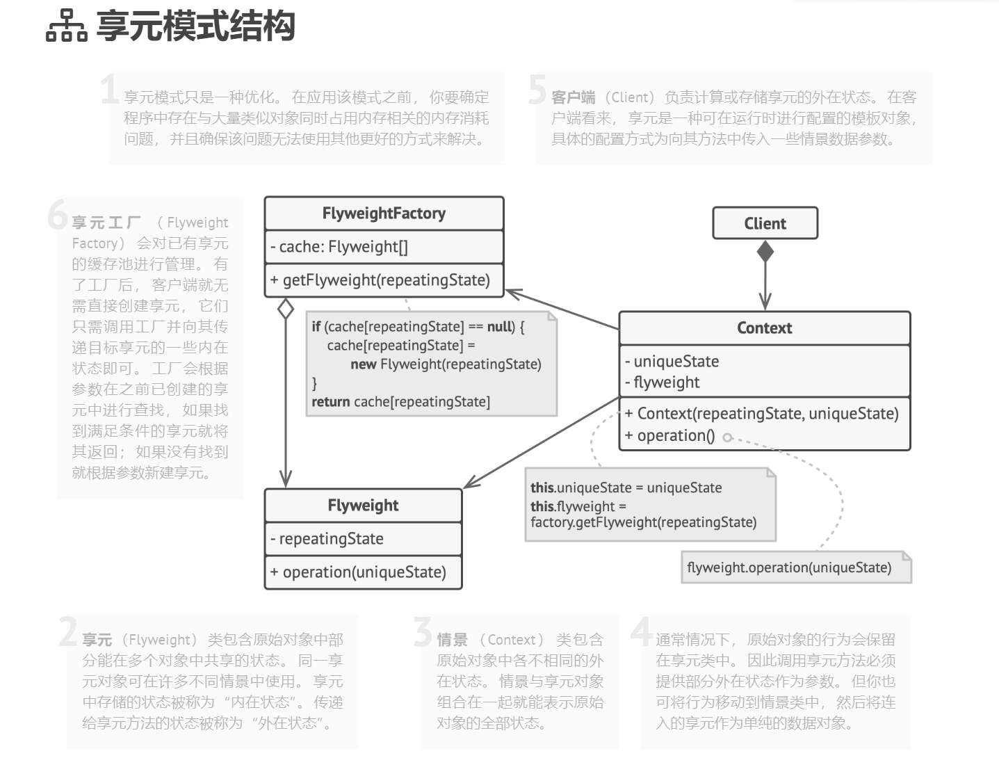

## 结构型模式（Structural Patterns）

### 享元模式（Flyweight Pattern）难度：4星

参考：https://refactoringguru.cn/design-patterns/flyweight


享元模式： 主要用于减少创建对象的数量，以减少内存占用和提高性能。享元模式尝试重用现有的同类对象，如果未找到匹配的对象，则创建新对象。

##### 使用场景：

创建对象消耗较大的资源，可以将这些资源进行池化，一般数据库的连接池，线程池就用到了享元模式。

##### UML图：



##### 需求描述：

游戏创建角色换皮肤功能，换皮肤时，当前游戏角色的：性别、身高不需要改变，仅改变角色的穿着这个属性。

享元：内部状态为:外貌、性别、身高;外部状态为：穿着

##### 外观模式：

```java
import java.util.HashMap;
import java.util.Map;

/**
 * @author ：lindo-zy https://github.com/lindo-zy
 * 享元模式：游戏创建角色换皮肤功能，换皮肤时，当前游戏角色的：性别、身高不需要改变，仅改变角色的穿着这个属性。
 * 享元：内部状态为:外貌、性别、身高;外部状态为：穿着
 */
public class FlyweightPattern {
    public static void main(String[] args) {
        //客户端使用
        Role heroRole = new RoleFactory().getRole("男", 180, "星际战甲");
        System.out.println(heroRole.hashCode());
        heroRole.changeDress("至臻冰甲");
        System.out.println(heroRole.hashCode());
        heroRole.changeDress("轮回披风");
        System.out.println(heroRole.hashCode());

    }

    /**
     * 角色接口
     */
    interface Role {


        /**
         * 换皮肤
         *
         * @param dress
         */
        void changeDress(String dress);

    }

    /**
     * 英雄角色类
     */
    static class HeroRole implements Role {
        //内部状态
        private String sex;
        private int height;

        public HeroRole(String sex, int height) {
            this.sex = sex;
            this.height = height;
        }

        @Override
        public void changeDress(String dress) {
            System.out.println("性别：" + sex + "身高：" + height + ",当前皮肤为：" + dress);
        }
    }

    /**
     * 角色工厂类
     */
    static class RoleFactory {
        private static final Map<String, Role> ROLE_MAP = new HashMap<>();

        /**
         * 获取角色
         *
         * @param dress
         * @return
         */
        public Role getRole(String sex, int height, String dress) {
            Role role = ROLE_MAP.get(dress);
            if (role == null) {
                role = new HeroRole(sex, height);
                ROLE_MAP.put(dress, role);
            }

            return role;
        }
    }
}

```

#####   

#### 总结：

大大减少对象的创建，降低系统的内存，使效率提高。不过提高了系统的复杂度，需要分离出来外部状态和内部状态。对于需要进行池化管理的对象，首先考虑享元模式。

