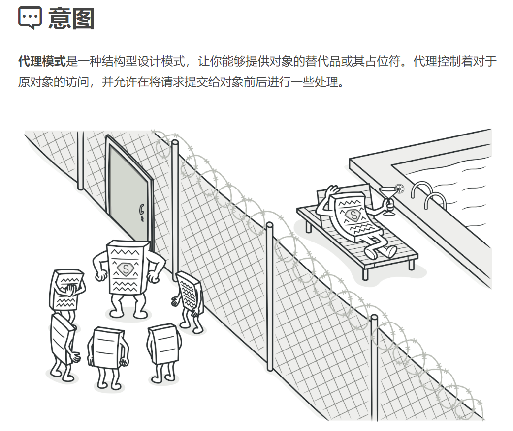
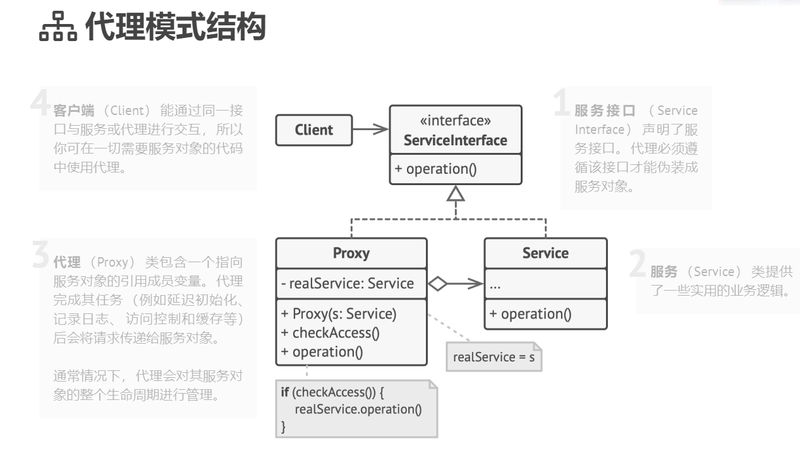

## 结构型模式（Structural Patterns）

### 代理模式（ProxyPattern）难度：3星

参考：https://refactoringguru.cn/design-patterns/proxy



代理模式： 一个类代表另外一个类的功能，并且能够控制这个类的访问方式。

##### 使用场景：

常见的web框架接口访问就使用的代理模式，针对接口访问我们可以添加代理类来控制访问，比如:添加访问限制。还有常见的数据库访问，JDBC就是典型的代理。

##### UML图：



##### 需求描述：

设计一个每秒钟只能访问10次的接口，超过次数拒绝访问。

##### 代理模式：

```java
/**
 * @author ：lindo-zy https://github.com/lindo-zy
 * 代理模式：设计一个每秒钟只能访问10次的接口，超过次数拒绝访问。
 */
public class ProxyPattern {
    public static void main(String[] args) {
        ServiceInterface proxy = new Proxy(new RealService());
        for (int i = 0; i < 11; i++) {
            proxy.request();
        }

    }

    /**
     * 服务接口
     */
    interface ServiceInterface {

        /**
         * 请求方法
         */
        void request();
    }

    /**
     * 具体实现类
     */
    static class RealService implements ServiceInterface {

        @Override
        public void request() {
            System.out.println("访问接口成功！");
        }
    }

    static class Proxy implements ServiceInterface {
        private int callCount = 0;
        private long lastCallTime = System.currentTimeMillis();
        private ServiceInterface realService;

        public Proxy(ServiceInterface realService) {
            this.realService = realService;
        }

        @Override
        public void request() {

            // 检查距离上次调用时间是否超过1分钟,是否超过10次调用限制
            long currentTime = System.currentTimeMillis();
            if (callCount >= 10 && currentTime - lastCallTime <= 1000) {
                System.out.println("请求过于频繁，请稍后重试！");
                return;
            }

            //更新调用次数和上次调用时间
            callCount++;
            lastCallTime = currentTime;

            // 调用真正的函数
            realService.request();
        }
    }
}

```

#####      

#### 总结：

代理模式在日常工程中随处可见，具有：职责清晰、扩展性高、智能化的优点，但是由于在真实访问的对象前加了一层代理对象，可能导致实际访问变慢，同时有些代理实现起来比较复杂，需要一定的编程技巧。