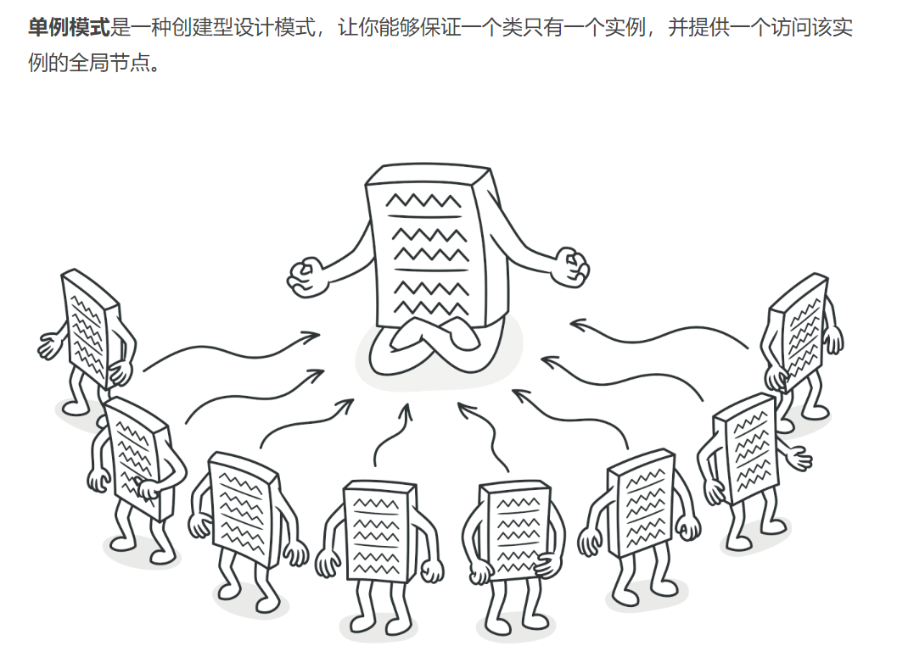
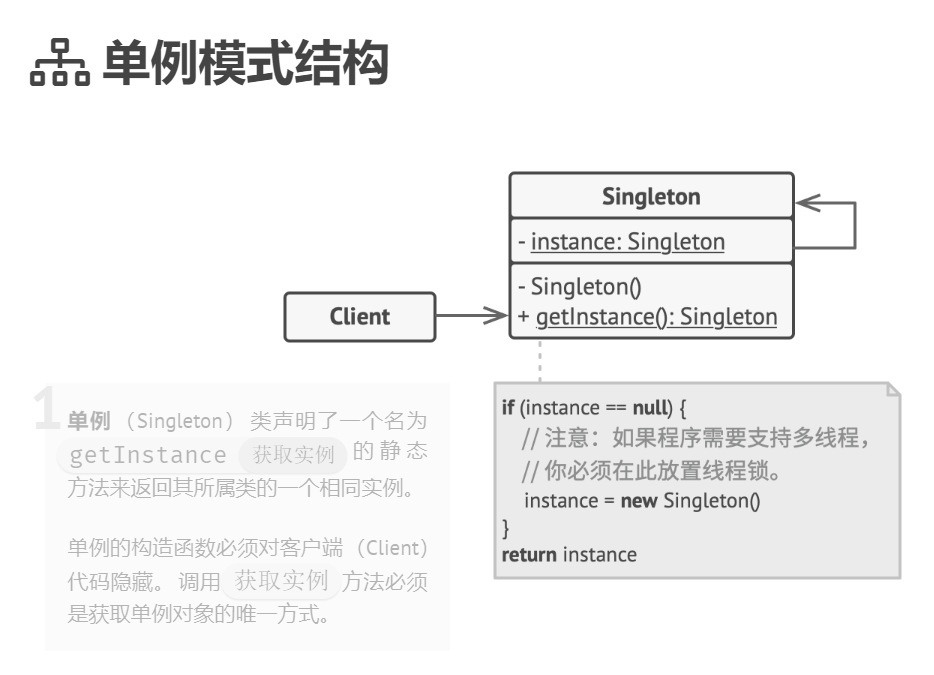

## 创建型模式（creational pattern）

### 单例模式（Singleton）难度：1星

参考：https://refactoringguru.cn/design-patterns/factory-method



单例模式：是一种创建型设计模式， 让你能够保证一个类只有一个实例， 并提供一个访问该实例的全局节点。这个类提供了一种访问其唯一的对象的方式，可以直接访问，不需要实例化该类的对象。

##### 使用场景：

一个类被多次实例化但是获取到的对象都是同一个，即内存地址就是一个，就可以用到单例模式，单例模式几乎无处不在。

##### UML图：



##### 需求描述：

实例化同一个类，但是得到的对象都是同一个。

##### 单例模式：

```java
/**
 * @author ：lindo-zy https://github.com/lindo-zy
 * 单例模式：
 * 1.懒汉式，线程不安全
 * 2.懒汉式，线程安全
 * 3.饿汉式，线程安全
 * 4.双锁类，线程安全
 * 5.静态内部类，线程安全
 * 6.枚举类实现，线程安全
 */
public class SingletonPattern {
    public static void main(String[] args) {

    }

    /**
     * 懒汉式，线程不安全,由于未加锁，所以多线程下不安全
     */
    static class LazySingleton {
        private static LazySingleton instance;

        private LazySingleton() {
        }

        public static LazySingleton getInstance() {
            if (instance == null) {
                instance = new LazySingleton();
            }
            return instance;
        }
    }

    /**
     * 带锁的懒汉式，线程安全，性能不行
     */
    static class LazySingletonWithLock {
        private static LazySingletonWithLock instance;

        private LazySingletonWithLock() {
        }

        public static synchronized LazySingletonWithLock getInstance() {
            if (instance == null) {
                instance = new LazySingletonWithLock();
            }
            return instance;
        }

    }

    /**
     * 饿汉式单例模式，线程安全，性能高，类加载就初始化，浪费内存
     */
    static class Singleton {
        private static Singleton instance = new Singleton();

        private Singleton() {
        }

        public static Singleton getInstance() {
            return instance;
        }
    }

    /**
     * 双重锁单例模式，线程安全，高性能
     */
    static class SingletonWithDoubleLock {
        //volatile关键字标记变量
        private volatile static SingletonWithDoubleLock instance;

        private SingletonWithDoubleLock() {
        }

        public static SingletonWithDoubleLock getInstance() {
            if (instance == null) {
                //加锁
                synchronized (SingletonWithDoubleLock.class) {
                    if (instance == null) {
                        instance = new SingletonWithDoubleLock();
                    }
                }
            }
            return instance;
        }


    }

    /**
     * 内部类实现的单例模式，只有在使用时，才用内部类加载单例，线程安全
     */
    static class SingletonInner {
        private static class SingletonHolder {
            private static final SingletonInner INSTANCE = new SingletonInner();
        }

        private SingletonInner() {
        }

        public static final SingletonInner getInstance() {
            return SingletonHolder.INSTANCE;
        }
    }

    /**
     * 枚举类实现单例，优雅安全高性能
     */
    static enum SingleByEnum {
        INSTANCE;

        public void method() {
        }
    }
}

```

#### 总结：

单例模式需要熟练掌握，并且在对应的环境使用不同方法编写单例模式。