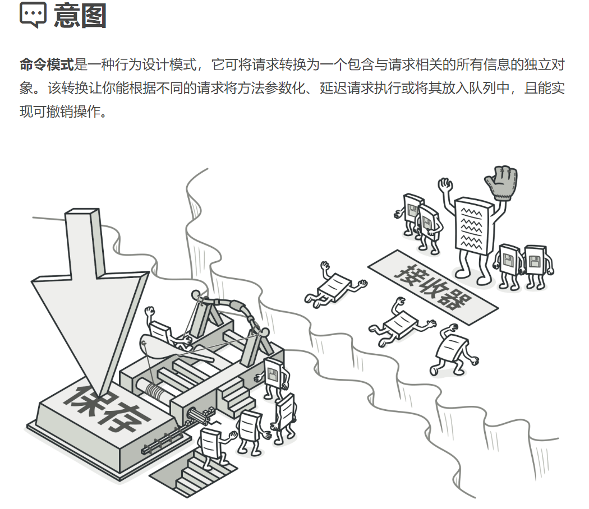
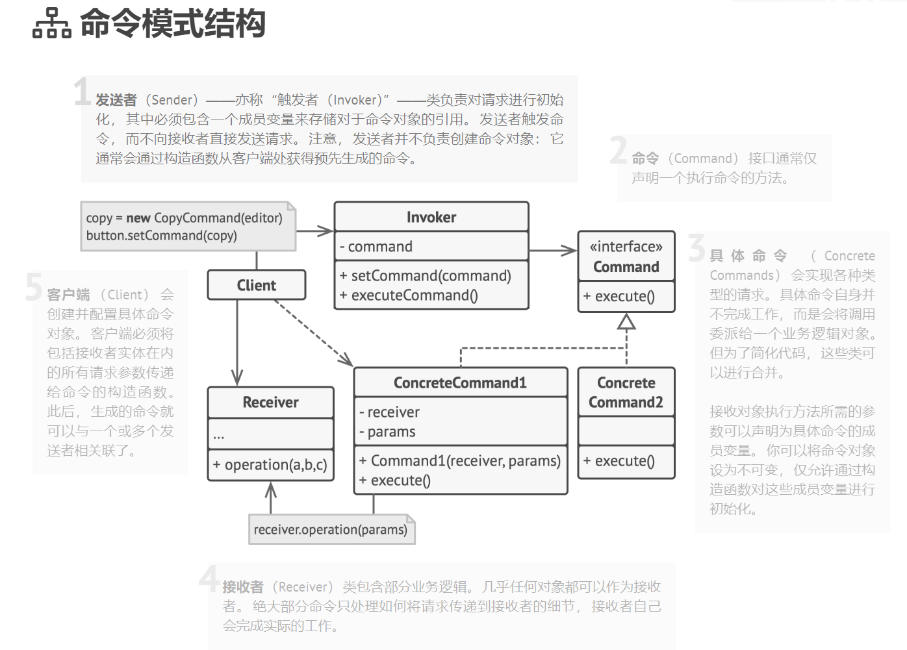

## 行为型模式（Behavioral Patterns）

### 命令模式（Adapter Pattern）难度：3星

参考：https://refactoringguru.cn/design-patterns/command



命令模式： 请求以命令的形式包裹在对象中，并传给调用对象。调用对象寻找可以处理该命令的合适的对象，并把该命令传给相应的对象，该对象执行命令。

##### 使用场景：

需要支持撤销和恢复的场景；认为命令的地方；每个地方需要给额外参数才能执行的。

##### UML图：



##### 需求描述：

设计一个点菜系统，菜单点菜->服务员->厨师

参考：https://blog.51cto.com/u_14943622/3309773

##### 命令模式：

```java
import java.util.ArrayList;
import java.util.List;

/**
 * @author poxiao
 * 命令模式：GUI的每个按钮都是命令；菜单点菜->服务员->厨师
 */
public class CommandPattern {
    public static void main(String[] args) {
        // 菜系 + 厨师；广东（粤菜）、山东（鲁菜）、四川（川菜）
        ICuisine guangDoneCuisine = new GuangDoneCuisine(new GuangDongCook());
        ShanDongCuisine shanDongCuisine = new ShanDongCuisine(new ShanDongCook());
        SiChuanCuisine siChuanCuisine = new SiChuanCuisine(new SiChuanCook());

        // 点单
        XiaoEr xiaoEr = new XiaoEr();

        xiaoEr.order(guangDoneCuisine);
        xiaoEr.order(shanDongCuisine);
        xiaoEr.order(siChuanCuisine);

        // 下单
        xiaoEr.placeOrder();
    }

    /**
     * 服务员，模拟点菜
     */
    static class XiaoEr {


        private List<ICuisine> cuisineList = new ArrayList<ICuisine>();

        public void order(ICuisine cuisine) {
            cuisineList.add(cuisine);
        }

        public synchronized void placeOrder() {
            for (ICuisine cuisine : cuisineList) {
                cuisine.cook();
            }
            cuisineList.clear();
        }

    }

    interface ICuisine {
        /**
         * 菜系
         */
        void cook();
    }

    interface ICook {
        /**
         * 做菜
         */
        void doCooking();
    }

    static class GuangDoneCuisine implements ICuisine {

        private ICook cook;

        public GuangDoneCuisine(ICook cook) {
            this.cook = cook;
        }

        @Override
        public void cook() {
            cook.doCooking();
        }

    }

    static class SiChuanCuisine implements ICuisine {

        private ICook cook;

        public SiChuanCuisine(ICook cook) {
            this.cook = cook;
        }

        @Override
        public void cook() {
            cook.doCooking();
        }

    }

    static class ShanDongCuisine implements ICuisine {

        private ICook cook;

        public ShanDongCuisine(ICook cook) {
            this.cook = cook;
        }

        @Override
        public void cook() {
            cook.doCooking();
        }

    }

    static class GuangDongCook implements ICook {

        @Override
        public void doCooking() {
            System.out.println("广东厨师，烹饪鲁菜，宫廷最大菜系，以孔府风味为龙头");
        }

    }

    static class SiChuanCook implements ICook {

        @Override
        public void doCooking() {
            System.out.println("四川厨师，烹饪川菜，中国最有特色的菜系，也是民间最大菜系。");
        }

    }

    static class ShanDongCook implements ICook {

        @Override
        public void doCooking() {
            System.out.println("山东厨师，烹饪鲁菜，宫廷最大菜系，以孔府风味为龙头");
        }

    }


}

```

#### 总结：

命令模式降低了系统的耦合度，新的命令很容易添加到系统；缺点是会导致过多的具体命令类。实际工程中命令模式使用不是很多，而且一般也不是很明显的看出来使用了命令模式。遇到特定的几个场景，可以用命令模式优化代码。

