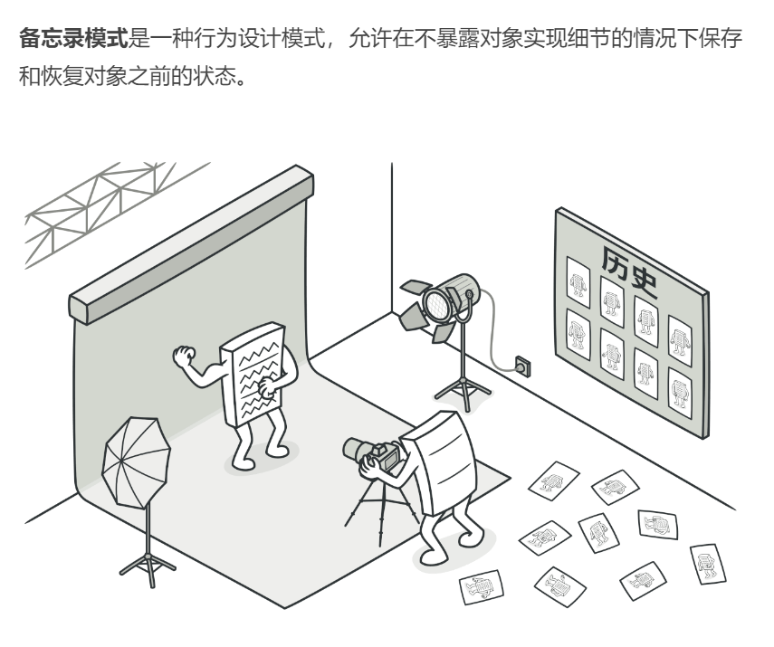
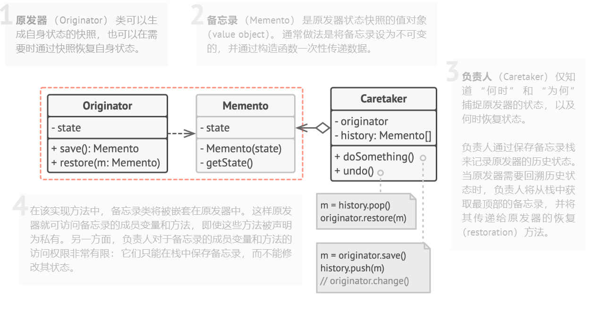

## 行为型模式（Behavioral Patterns）

### 备忘录模式（Memento Pattern）难度：2星

参考：https://refactoringguru.cn/design-patterns/memento



备忘录模式： 允许在不暴露对象实现细节的情况下保存和恢复对象之前的状态。

##### 使用场景：

游戏存档，文本编辑器等功能。

##### UML图：



##### 需求描述：

设计一个简单的游戏存档功能，支持保存和恢复游戏存档。

##### 备忘录模式：

```java
package behavioral_pattern.memento;

import java.util.ArrayList;
import java.util.List;

/**
 * @author ：lindo-zy https://github.com/lindo-zy
 * 备忘录模式：设计一个简单的游戏存档功能，支持保存和恢复游戏存档。
 */
public class MementoPattern {


    public static void main(String[] args) {

        GameOriginator gameOriginator = new GameOriginator();
        GameCareTaker gameCareTaker = new GameCareTaker();
        gameOriginator.playGame();
        gameCareTaker.saveMemento(gameOriginator.saveProcess());
        gameOriginator.exitGame();

        gameOriginator.restoreProcess(gameCareTaker.getMemento(0));
        gameOriginator.playGame();
    }

    /**
     * 游戏原发器
     */
    static class GameOriginator {
        private int currentScore;

        public GameProgressMemento saveProcess() {
            return new GameProgressMemento(currentScore);
        }

        public void restoreProcess(GameProgressMemento gameProgressMemento) {
            currentScore = gameProgressMemento.getScore();
        }

        //对内部状态的使用
        public void playGame() {
            System.out.println("------------------开始游戏------------------");
            System.out.println("当前分数为：" + currentScore);
            System.out.println("杀死一个小怪物得1分");
            currentScore++;
            System.out.printf("总分为：%d%n", currentScore);
        }

        public void exitGame() {
            System.out.println("退出游戏");
            currentScore = 0;
            System.out.println("-----------------退出游戏-------------------");
        }
    }

    /**
     * 构建备忘录
     */
    static class GameProgressMemento {
        private int score;

        public GameProgressMemento(int score) {
            this.score = score;
        }

        public int getScore() {
            return this.score;
        }
    }

    /**
     * 游戏存档管理器
     */
    static class GameCareTaker {
        private List<GameProgressMemento> mementos = new ArrayList<>();

        /**
         * 保存存档
         *
         * @param memento
         */
        public void saveMemento(GameProgressMemento memento) {
            this.mementos.add(memento);
        }

        /**
         * 读取存档
         *
         * @param index
         * @return
         */
        public GameProgressMemento getMemento(int index) {
            return this.mementos.get(index);
        }
    }
}

```

#### 总结：

备忘录模式比较简单，使用的范围比较明确，当遇到有保存恢复这类需求时，就使用备忘录模式。

