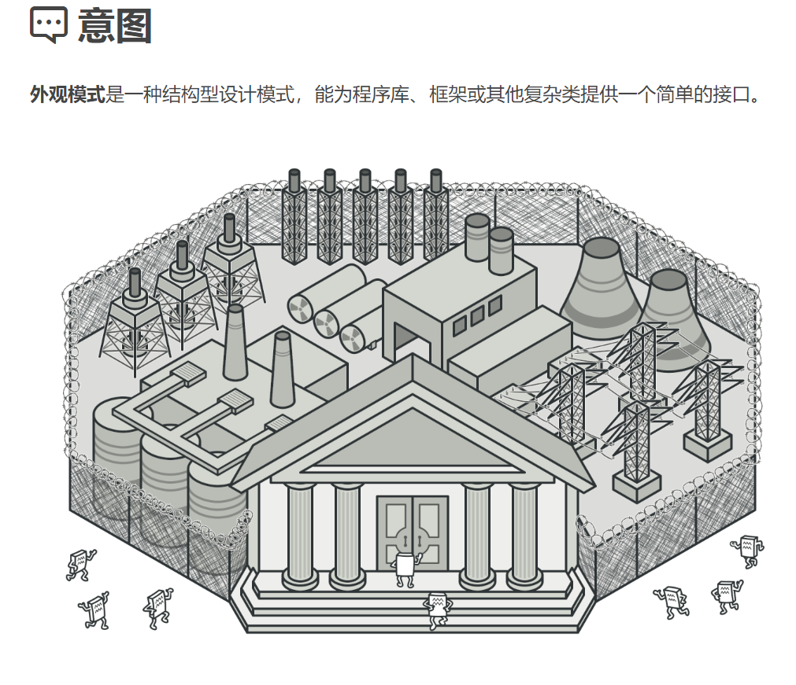
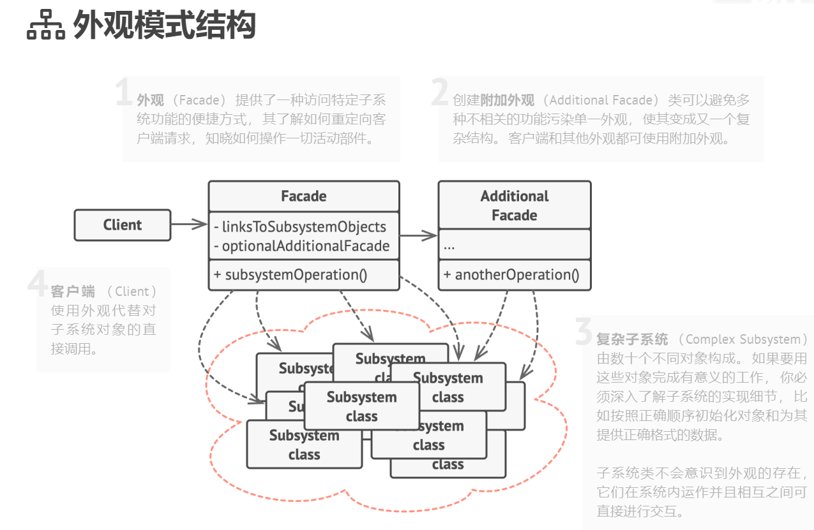

## 结构型模式（Structural Patterns）

### 外观模式（Facade Pattern）难度：1星

参考：https://refactoringguru.cn/design-patterns/facade



外观模式： 又叫做门面模式，隐藏系统的复杂性，并向客户端提供了一个客户端可以访问系统的接口。

##### 使用场景：

常见的各种SDK就是外观模式，几乎每个工程代码都有涉及，只是你不知道使用了叫外观模式的设计模式而已。

##### UML图：



##### 需求描述：

客户到在手机商城购买商品。

子系统：下单、支付、物流

外观：购物操作接口

##### 外观模式：

```java
/**
 * @author ：lindo-zy https://github.com/lindo-zy
 * 外观模式:客户到在手机商城购买商品。
 * 子系统：下单、支付、物流
 * 外观：购物操作接口
 */
public class FacadePattern {
    public static void main(String[] args) {
        //对客户端就看到这个类
        ShoppingFacade shoppingFacade = new ShoppingFacade();

        shoppingFacade.shopping();

    }

    /**
     * 下单系统
     */
    static class OrderSystem {

        /**
         * 获取订单号
         *
         * @param orderName
         * @return
         */
        public void getOrder(String orderName) {
            System.out.println("订单：" + orderName);
        }

    }

    /**
     * 支付系统
     */
    static class PaySystem {
        public void getPay(int payNum) {
            System.out.println("支付金额：" + payNum);
        }

    }

    /**
     * 物流系统
     */
    static class LogisticsSystem {
        /**
         * 获取物流信息
         *
         * @param logisticsInfo
         * @return
         */
        public void getLogistics(String logisticsInfo) {
            System.out.println("商品物流信息：" + logisticsInfo);
        }

    }


    /**
     * 购物外观类
     */
    static class ShoppingFacade {
        public void shopping() {
            //引入子模块，就是外观模式
            OrderSystem orderSystem = new OrderSystem();
            PaySystem paySystem = new PaySystem();
            LogisticsSystem logisticsSystem = new LogisticsSystem();

            orderSystem.getOrder("iphone 20 pro");
            paySystem.getPay(200);
            logisticsSystem.getLogistics("已发货");
        }

    }

}

```

#####       

#### 总结：

比较简单常用的一个设计模式，开发中随时都在使用，减少了系统的相互依赖，灵活性高，但是这个模式也有他的缺点：不符合开闭原则，需要修改东西很麻烦，继承和重写都不合适。

