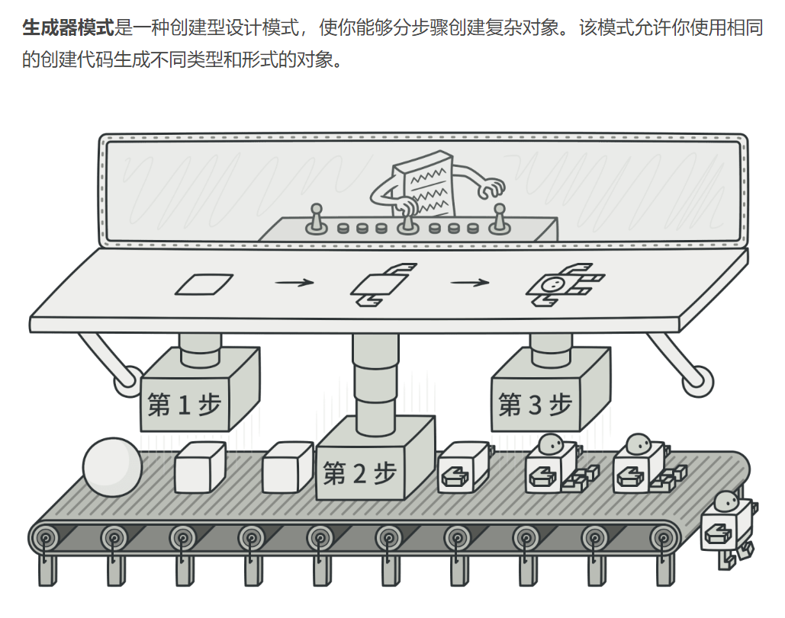
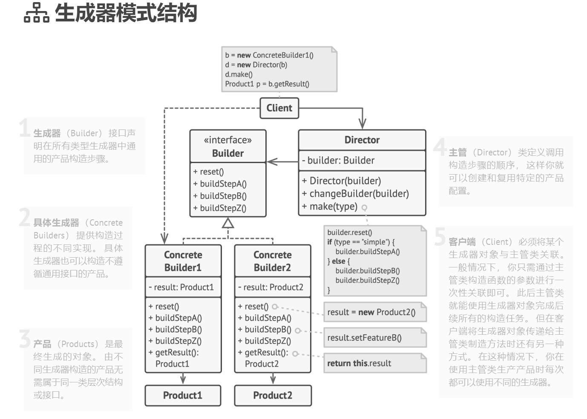

## 创建型模式（creational pattern）

### 抽象工厂模式（Builder）难度：3星

参考：https://refactoringguru.cn/design-patterns/builder



建造者模式(生成器模式)：使用多个简单的对象一步一步构建成一个复杂的对象。

##### 使用场景：

当某个类构造时，需要多个参数(一般是4个参数以上)，且某些参数还是可变参数时，就考虑用建造者模式。

##### UML图：



##### 需求描述：

肯德基疯狂星期四：V我50，马上上车。提供多个套餐组合：但是必选汉堡和可乐，其余可以搭配：薯条、炸鸡、烤翅。里面又细分为，汉堡：奥尔良、脆皮鸡排；可乐：大杯、小杯；薯条：大薯、小薯；炸鸡：大份、小份；烤翅：单个、一对。

具体建造者：疯狂星期四建套餐造者

产品：疯狂星期四套餐

(例子省略了建造者接口和主管类，这2个在建造者模式里面非必要存在)

##### 先看不使用建造者模式的例子

```java
/**
 * @author ：lindo-zy https://github.com/lindo-zy
 * 不使用建造者模式的反例
 * 肯德基疯狂星期四：V我50，马上上车。提供多个套餐组合：但是必选汉堡和可乐，其余可以搭配：薯条、炸鸡、烤翅。
 * 里面又细分为，汉堡：奥尔良、脆皮鸡排；可乐：大杯、小杯；薯条：大薯、小薯；炸鸡：大份、小份；烤翅：单个、一对。
 */
public class Normal {
    public static void main(String[] args) {
        //套餐1
        CrayKfc crayKfc1 = new CrayKfc(new Hamburger("奥尔良"), new Cola("百事"));

        System.out.println("----------");
        //套餐5
        CrayKfc crayKfc5 = new CrayKfc(new Hamburger("鸡排"), new Cola("可口"), new Wings("一对"));

        //可以看出来，这样写是很简单，但是构造函数需要写很多，而且使用起来特别不方便

    }

    /**
     * 疯狂星期四类
     */
    static class CrayKfc {
        private Hamburger hamburger;//汉堡，必须
        private Cola cola;//可乐,必选
        private FrenchFries frenchFries;//薯条，可选
        private FriedChicken friedChicken;//炸鸡，可选
        private Wings wings;//鸡翅；可选

        //如果我们有5类套餐

        //套餐1：只有汉堡和可乐
        public CrayKfc(Hamburger hamburger, Cola cola) {
            this.hamburger = hamburger;
            this.cola = cola;
        }

        //套餐2：汉堡、可乐、薯条
        public CrayKfc(Hamburger hamburger, Cola cola, FrenchFries frenchFries) {
            this.hamburger = hamburger;
            this.cola = cola;
            this.frenchFries = frenchFries;
        }

        //套餐3：汉堡、可乐、薯条、炸鸡
        public CrayKfc(Hamburger hamburger, Cola cola, FrenchFries frenchFries, FriedChicken friedChicken) {
            this.hamburger = hamburger;
            this.cola = cola;
            this.frenchFries = frenchFries;
            this.friedChicken = friedChicken;
        }

        //套餐4：汉堡、可乐、薯条、炸鸡、鸡翅
        public CrayKfc(Hamburger hamburger, Cola cola, FrenchFries frenchFries, FriedChicken friedChicken, Wings wings) {
            this.hamburger = hamburger;
            this.cola = cola;
            this.frenchFries = frenchFries;
            this.friedChicken = friedChicken;
            this.wings = wings;
        }

        //套餐5：汉堡、可乐、鸡翅
        public CrayKfc(Hamburger hamburger, Cola cola, Wings wings) {
            this.hamburger = hamburger;
            this.cola = cola;
            this.wings = wings;
        }
    }

    /**
     * 汉堡类
     */
    static class Hamburger {

        public Hamburger(String name) {
            if ("奥尔良".equals(name)) {
                orleansHamburg();
            }
            if ("鸡排".equals(name)) {
                chickenSteakHamburger();
            }
        }

        public void orleansHamburg() {
            System.out.println("奥尔良汉堡！");
        }

        public void chickenSteakHamburger() {
            System.out.println("鸡排汉堡！");
        }
    }

    /**
     * 可乐类
     */
    static class Cola {

        public Cola(String name) {
            if ("百事".equals(name)) {
                pepsiCola();
            }
            if ("可口".equals(name)) {
                cocaCola();
            }
        }

        public void pepsiCola() {
            System.out.println("百事可乐！");
        }

        public void cocaCola() {
            System.out.println("可口可乐！");
        }
    }

    /**
     * 薯条类
     */
    static class FrenchFries {
        public FrenchFries(String name) {
            if ("大薯".equals(name)) {
                bigFrenchFries();
            }
            if ("小薯".equals(name)) {
                smallFrenchFries();
            }
        }

        public void bigFrenchFries() {
            System.out.println("大薯！");
        }

        public void smallFrenchFries() {
            System.out.println("小薯！");
        }
    }

    /**
     * 炸鸡类
     */
    static class FriedChicken {

        public FriedChicken(String name) {
            if ("大份".equals(name)) {
                largeFriedChicken();
            }
            if ("小份".equals(name)) {
                smallFriedChicken();
            }
        }

        public void largeFriedChicken() {
            System.out.println("大份炸鸡！");
        }

        public void smallFriedChicken() {
            System.out.println("小份炸鸡！");
        }
    }

    /**
     * 烤翅类
     */
    static class Wings {

        public Wings(String name) {
            if ("单个".equals(name)) {
                singleWings();
            }
            if ("一对".equals(name)) {
                doubleWings();

            }
        }

        public void singleWings() {
            System.out.println("单个烤翅！");
        }

        public void doubleWings() {
            System.out.println("一对烤翅！");
        }
    }
}

```

##### 使用建造者模式：

```java
/**
 * @author ：lindo-zy https://github.com/lindo-zy
 * * 肯德基疯狂星期四：V我50，马上上车。提供多个套餐组合：但是必选汉堡和可乐，其余可以搭配：薯条、炸鸡、烤翅。
 * * 里面又细分为，汉堡：奥尔良、脆皮鸡排；可乐：大杯、小杯；薯条：大薯、小薯；炸鸡：大份、小份；烤翅：单个、一对。
 * 如果我们有5类套餐
 * 套餐1：只有汉堡和可乐
 * 套餐2：汉堡、可乐、薯条
 * 套餐3：汉堡、可乐、薯条、炸鸡
 * 套餐4：汉堡、可乐、薯条、炸鸡、鸡翅
 * 套餐5：汉堡、可乐、鸡翅
 */
public class BuilderPattern {
    public static void main(String[] args) {

        //套餐1
        CrayKfc crayKfc1 = new CrazyKfcBuilder(new Hamburger("奥尔良"), new Cola("可口")).build();
        System.out.println("--------------");
        //套餐4
        CrayKfc crayKfc4 = new CrazyKfcBuilder(new Hamburger("鸡排"), new Cola("百事")
        ).setFrenchFries(new FrenchFries("大薯")).setFriedChicken(new FriedChicken("小份")
        ).setWings(new Wings("一对")).build();

        //可以看出，我们使用CrazyKfcBuilder的链式调用，很优雅的就可以灵活的添加需要构造的方法


    }

    /**
     * 疯狂星期四类
     */
    static class CrayKfc {
        private final Hamburger hamburger;//汉堡，必须
        private final Cola cola;//可乐,必选
        private final FrenchFries frenchFries;//薯条，可选
        private final FriedChicken friedChicken;//炸鸡，可选
        private final Wings wings;//鸡翅；可选

        //此时，构造者来进行构造
        private CrayKfc(CrazyKfcBuilder crazyKfcBuilder) {
            this.hamburger = crazyKfcBuilder.hamburger;
            this.cola = crazyKfcBuilder.cola;
            this.frenchFries = crazyKfcBuilder.frenchFries;
            this.friedChicken = crazyKfcBuilder.friedChicken;
            this.wings = crazyKfcBuilder.wings;

        }

    }

    /**
     * 汉堡类
     */
    static class Hamburger {

        public Hamburger(String name) {
            if ("奥尔良".equals(name)) {
                orleansHamburg();
            }
            if ("鸡排".equals(name)) {
                chickenSteakHamburger();
            }
        }

        public void orleansHamburg() {
            System.out.println("奥尔良汉堡！");
        }

        public void chickenSteakHamburger() {
            System.out.println("鸡排汉堡！");
        }
    }

    /**
     * 可乐类
     */
    static class Cola {

        public Cola(String name) {
            if ("百事".equals(name)) {
                pepsiCola();
            }
            if ("可口".equals(name)) {
                cocaCola();
            }
        }

        public void pepsiCola() {
            System.out.println("百事可乐！");
        }

        public void cocaCola() {
            System.out.println("可口可乐！");
        }
    }

    /**
     * 薯条类
     */
    static class FrenchFries {
        public FrenchFries(String name) {
            if ("大薯".equals(name)) {
                bigFrenchFries();
            }
            if ("小薯".equals(name)) {
                smallFrenchFries();
            }
        }

        public void bigFrenchFries() {
            System.out.println("大薯！");
        }

        public void smallFrenchFries() {
            System.out.println("小薯！");
        }
    }

    /**
     * 炸鸡类
     */
    static class FriedChicken {

        public FriedChicken(String name) {
            if ("大份".equals(name)) {
                largeFriedChicken();
            }
            if ("小份".equals(name)) {
                smallFriedChicken();
            }
        }

        public void largeFriedChicken() {
            System.out.println("大份炸鸡！");
        }

        public void smallFriedChicken() {
            System.out.println("小份炸鸡！");
        }
    }

    /**
     * 烤翅类
     */
    static class Wings {

        public Wings(String name) {
            if ("单个".equals(name)) {
                singleWings();
            }
            if ("一对".equals(name)) {
                doubleWings();

            }
        }

        public void singleWings() {
            System.out.println("单个烤翅！");
        }

        public void doubleWings() {
            System.out.println("一对烤翅！");
        }
    }


    /**
     * 疯狂星期四构造者
     */
    static class CrazyKfcBuilder {
        private Hamburger hamburger;//汉堡，必须
        private Cola cola;//可乐,必选
        private FrenchFries frenchFries;//薯条，可选
        private FriedChicken friedChicken;//炸鸡，可选
        private Wings wings;//鸡翅；可选


        public CrazyKfcBuilder(Hamburger hamburger, Cola cola) {
            this.hamburger = hamburger;
            this.cola = cola;
        }

        //建造方法
        public CrayKfc build() {
            return new CrayKfc(this);
        }


        public FrenchFries getFrenchFries() {
            return frenchFries;
        }

        //set方法返回this,用于链式调用
        public CrazyKfcBuilder setFrenchFries(FrenchFries frenchFries) {
            this.frenchFries = frenchFries;
            return this;
        }

        public FriedChicken getFriedChicken() {
            return friedChicken;
        }

        public CrazyKfcBuilder setFriedChicken(FriedChicken friedChicken) {
            this.friedChicken = friedChicken;
            return this;
        }

        public Wings getWings() {
            return wings;
        }

        public CrazyKfcBuilder setWings(Wings wings) {
            this.wings = wings;
            return this;
        }
    }

}

```

#### 总结：

这是一个需要掌握的设计模式，他应用的条件也很明显：参数多且带有可选参数，同时存在可以灵活的组合形式，就选用建造者模式。本文未采用经典建造者模式举例，有兴趣的小伙伴可以网上自行查阅文章。