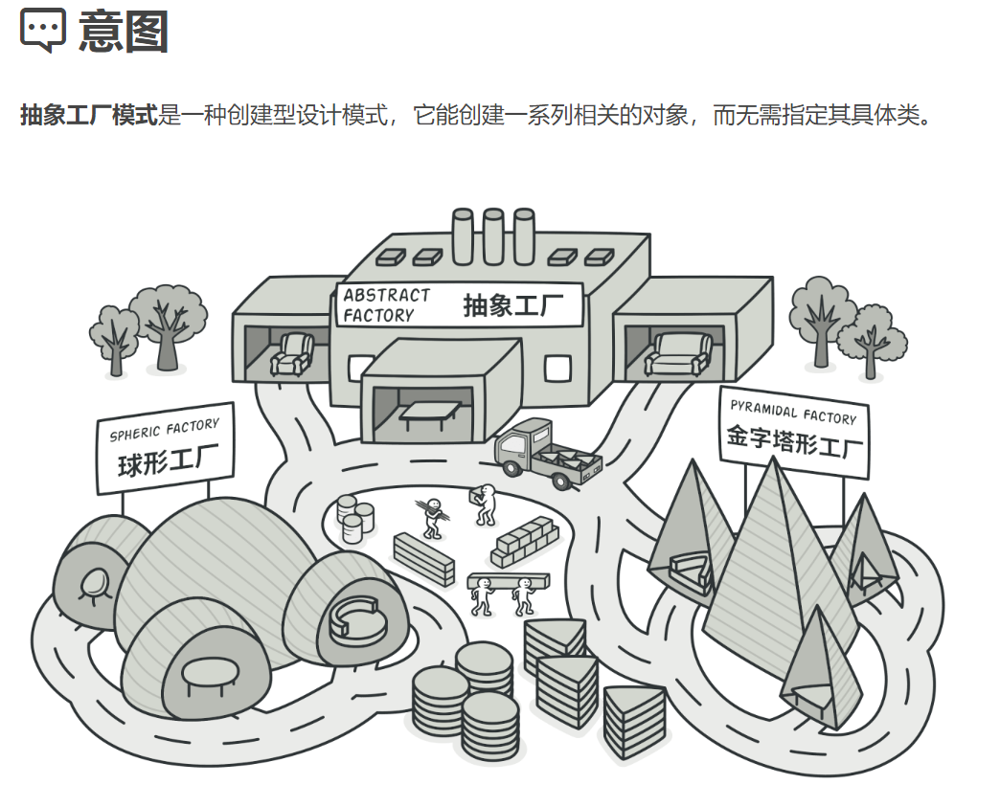
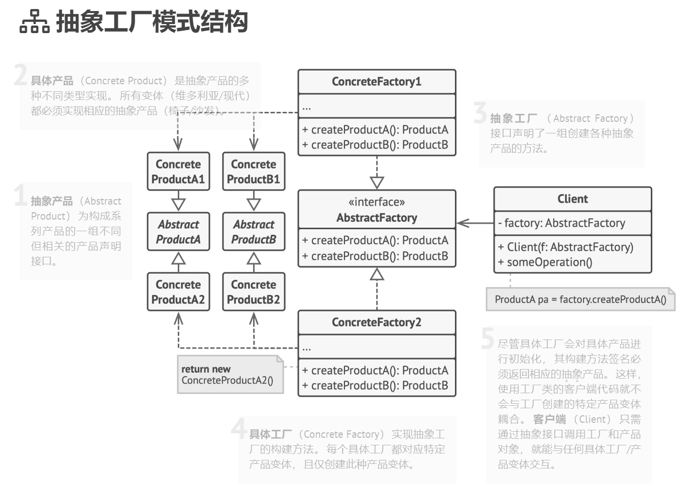

## 创建型模式（creational pattern）

### 抽象工厂模式（Abstract Factory）难度：4星

参考：https://refactoringguru.cn/design-patterns/factory-method



抽象工厂模式：是一种创建型设计模式， 它能创建一系列相关的对象， 而无需指定其具体类。接口是负责创建一个相关对象的工厂，不需要显式指定它们的类。每个生成的工厂都能按照工厂模式提供对象。

##### 使用场景：

当业务中出现产品族来生产下面的一系列产品时，就需要使用到抽象工厂。

##### UML图：



##### 需求描述：

比如我们要购买汽车，大众，丰田，特斯拉都生产轿车；但是，有一天他们都可以生产suv了，他们厂也要支持他们生产suv

产品族：汽车工厂可以生产不同汽车产品

产品1：轿车

具体产品：大众轿车、丰田轿车、特斯拉轿车

产品2：suv

具体产品：大众suv、丰田suv、特斯拉suv

抽象工厂：车厂：生产轿车、生产suv

具体工厂：大众车厂、丰田车厂、特斯拉车厂

##### 先看不使用抽象工厂模式的例子

```java
/**
 * @author ：lindo-zy https://github.com/lindo-zy
 * 抽象工厂模式反例
 * 需求：比如我们要购买汽车，大众，丰田，特斯拉都生产轿车；
 * 但是，有一天他们都可以生产suv了，我们也要支持他们生产suv
 */
public class Normal {
    public static void main(String[] args) {
        // 从下面实例化可以看出，客户端需要具体类才能创建出具体对象，而且随着需要的对象增加，具体对象也要增加
        VolkswagenCar volkswagenCar = new VolkswagenCar();

        TeslaCar teslaCar = new TeslaCar();

        ToyotaCar toyotaCar = new ToyotaCar();

    }

    static class VolkswagenCar {

        public void sedan() {
        }

        ;

        public void suv() {
        }

        ;

    }

    static class TeslaCar {
        public void sedan() {
        }

        ;

        public void suv() {
        }

        ;
    }

    static class ToyotaCar {
        public void sedan() {
        }

        ;

        public void suv() {
        }

        ;
    }
}

```

##### 使用工厂模式：

```java
/**
 * @author ：lindo-zy https://github.com/lindo-zy
 * 抽象工厂模式
 * 需求：比如我们要购买汽车，大众，丰田，特斯拉都生产轿车；
 * 但是，有一天他们都可以生产suv了，他们厂也要支持他们生产suv
 */
public class AbstractFactoryPattern {
    public static void main(String[] args) {
        // 大众工厂生产大众的产品
        AbstractFactory volkswagen = new VolkswagenFactory();
        volkswagen.makeSedan().sale();
        volkswagen.makeSuv().sale();

        // 特斯拉工厂生产特斯拉产品
        AbstractFactory tesla = new TeslaFactory();
        tesla.makeSedan().sale();
        tesla.makeSuv().sale();

        // 丰田工厂生产丰田产品
        AbstractFactory toyota = new ToyotaFactory();
        toyota.makeSedan().sale();
        toyota.makeSuv().sale();

        //这里可以看出，这是一个产品族的概念，就是一个厂的不同产品放到一个厂来生产管理

    }

    /**
     * 轿车产品接口
     */
    interface SedanCar {
        /**
         * 轿车产品方法
         */
        void sale();
    }

    /**
     * 大众轿车产品
     */
    static class VolkswagenSedanCar implements SedanCar {

        @Override
        public void sale() {
            System.out.println("大众汽车：轿车！");
        }
    }

    /**
     * 特斯拉轿车产品
     */
    static class TeslaSedanCar implements SedanCar {

        @Override
        public void sale() {
            System.out.println("特斯拉汽车：轿车！");
        }
    }

    /**
     * 丰田轿车产品
     */
    static class ToyotaSedanCar implements SedanCar {

        @Override
        public void sale() {
            System.out.println("丰田汽车：轿车！");
        }
    }

    /**
     * SUV产品接口
     */
    interface SuvCar {
        /**
         * SUV产品方法
         */
        void sale();
    }

    /**
     * 大众SUV产品
     */
    static class VolkswagenSuvCar implements SuvCar {

        @Override
        public void sale() {
            System.out.println("大众汽车：SUV！");
        }
    }

    /**
     * 特斯拉SUV产品
     */
    static class TeslaSuvCar implements SuvCar {

        @Override
        public void sale() {
            System.out.println("特斯拉：SUV！");
        }
    }

    /**
     * 丰田SUV产品
     */
    static class ToyotaSuvCar implements SuvCar {

        @Override
        public void sale() {
            System.out.println("丰田汽车：SUV！");
        }
    }

    /**
     * 工厂接口
     */
    interface AbstractFactory {
        /**
         * 轿车产品工厂方法
         *
         * @retrun 轿车实例
         */
        SedanCar makeSedan();

        /**
         * suv产品工厂方法
         *
         * @retrun suv实例
         */
        SuvCar makeSuv();
    }

    /**
     * 大众汽车工厂
     */
    static class VolkswagenFactory implements AbstractFactory {

        @Override
        public SedanCar makeSedan() {
            return new VolkswagenSedanCar();
        }

        @Override
        public SuvCar makeSuv() {
            return new VolkswagenSuvCar();
        }
    }

    /**
     * 特斯拉汽车工厂
     */
    static class TeslaFactory implements AbstractFactory {

        @Override
        public SedanCar makeSedan() {
            return new TeslaSedanCar();
        }

        @Override
        public SuvCar makeSuv() {
            return new TeslaSuvCar();
        }
    }

    /**
     * 丰田汽车工厂
     */
    static class ToyotaFactory implements AbstractFactory {

        @Override
        public SedanCar makeSedan() {
            return new ToyotaSedanCar();
        }

        @Override
        public SuvCar makeSuv() {
            return new ToyotaSuvCar();
        }
    }

}

```

#### 总结：

抽象工厂模式比起工厂模式，多了2个难点：1.需要具备产品族的概念 2.实际生产应用中，如何抽象这一层产品族出来。一般在代码重构时，会用上这个模式，一旦能应用到抽象工厂模式，说明代码结构和扩展性是十分好的。