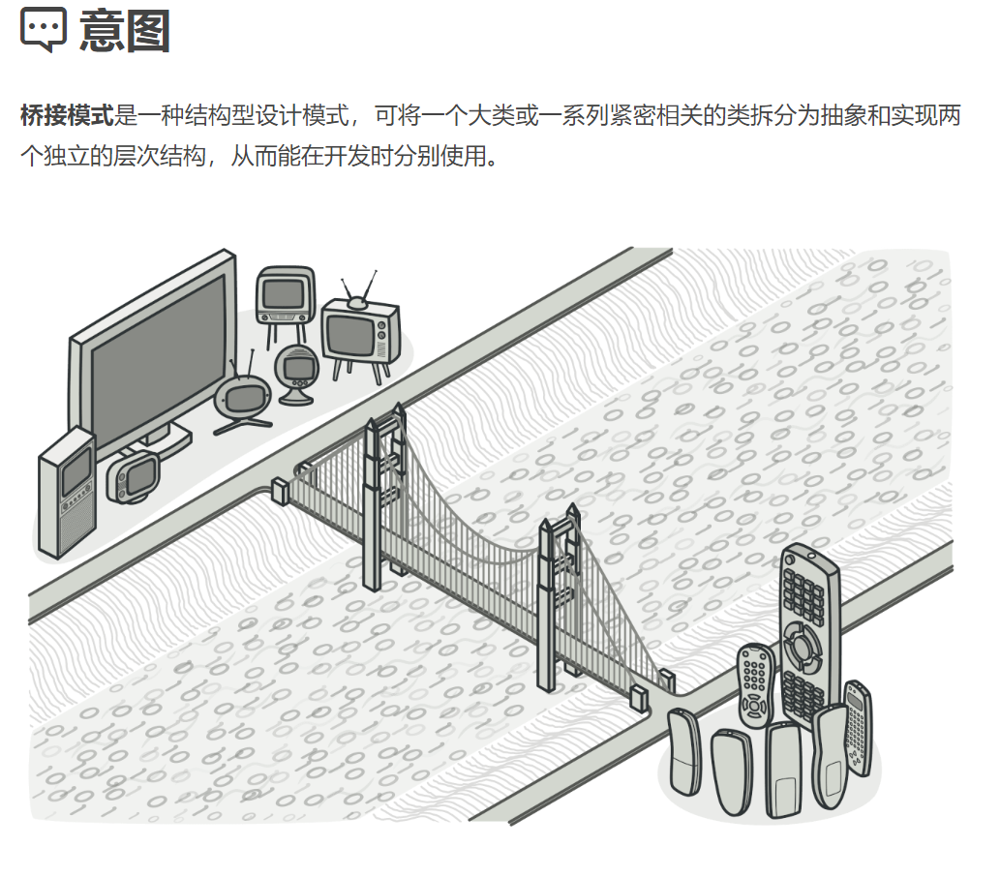
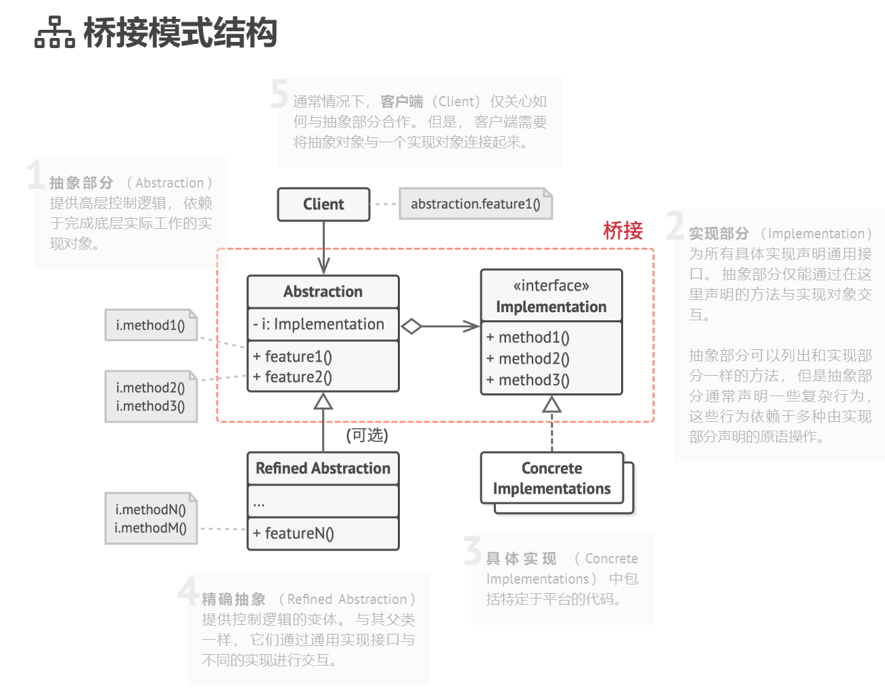

## 结构型模式（Structural Patterns）

### 桥接模式（Bridge Pattern）难度：1星

参考：https://refactoringguru.cn/design-patterns/bridge



桥接模式： 涉及到一个作为桥接的接口，使得实体类的功能独立于接口实现类。这两种类型的类可被结构化改变而互不影响。

##### 使用场景：

一般用于框架开发使用。这里面的抽象部分和实部分现两个层次，理解起来比较复杂。可以简单理解为，桥的两头A和B，AB可以任意变化，A变化不影响B，B变化不影响A，但是他们又是有关系的。当你的代码出现笛卡尔积数量的类时，考虑用桥接模式，实现组合的数量:
如，3*4改为3+4。

##### UML图：



##### 需求描述：

奶茶分为，小杯，中杯，大杯；根据甜度，又分为，五分糖，七分糖，全糖。

抽象部分：杯子大小

实现部分：糖的分量

糖必须加在杯子里面，即为二者关系

##### 不使用设计模式：

```java
/**
 * @author ：lindo-zy https://github.com/lindo-zy
 * 奶茶分为，小杯，中杯，大杯；根据甜度，又分为，五分糖，七分糖，全糖。
 */
public class Normal {
    public static void main(String[] args) {
        SmallMilkTea smallTeaWithFiveSugar = new SmallMilkTea("半糖");
        LargeMilkTea largeTeaWithFullSugar = new LargeMilkTea("全糖");

        smallTeaWithFiveSugar.makeTea();
        largeTeaWithFullSugar.makeTea();
        
        //小杯奶茶半糖
        //大杯奶茶全糖
    }

    /**
     * 奶茶类
     */
    static class MilkTea {
        protected String size;
        protected String sugar;

        public MilkTea(String size, String sugar) {
            this.size = size;
            this.sugar = sugar;
        }

        public void makeTea() {
            System.out.print(size + "奶茶");
            switch (sugar) {
                case "半糖":
                    System.out.println("半糖");
                    break;
                case "七分糖":
                    System.out.println("七分糖");
                    break;
                case "全糖":
                    System.out.println("全糖");
                    break;
                default:
                    break;
            }
        }
    }

    static class SmallMilkTea extends MilkTea {
        public SmallMilkTea(String sugar) {
            super("小杯", sugar);
        }
    }

    static class MediumMilkTea extends MilkTea {
        public MediumMilkTea(String sugar) {
            super("中杯", sugar);
        }
    }

    static class LargeMilkTea extends MilkTea {
        public LargeMilkTea(String sugar) {
            super("大杯", sugar);
        }
    }
}


```

##### 桥接模式：

```java
/**
 * @author ：lindo-zy https://github.com/lindo-zy
 * 桥接模式:奶茶分为，小杯，中杯，大杯；根据甜度，又分为，五分糖，七分糖，全糖。
 * 后续如果添加了，超大杯，只需要添加一个杯子相关子类即可
 */
public class BridgePattern {
    public static void main(String[] args) {

        RefinedMilkTea largeMilkTea = new LargeMilkTea(new FullSugar());
        largeMilkTea.orderMilkTea();

        RefinedMilkTea smallMilkTea = new SmallMilkTea(new HalfSugar());
        smallMilkTea.orderMilkTea();

        //全糖！
        //大杯奶茶！
        //半糖！
        //小杯奶茶！
    }


    /**
     * 糖分量的实现化接口
     */
    interface SugarImplementor {
        /**
         * 加糖操作
         */
        void addSugar();
    }


    /**
     * 抽象化部分
     */
    static abstract class MilkTea {
        //此处进行桥接
        protected SugarImplementor sugarImplementor;

        public MilkTea(SugarImplementor sugarImplementor) {
            this.sugarImplementor = sugarImplementor;
        }

        /**
         * 点奶茶
         */
        public abstract void orderMilkTea();
    }


    /**
     * 精确抽象化部分
     */
    static abstract class RefinedMilkTea extends MilkTea {
        public RefinedMilkTea(SugarImplementor sugarImplementor) {
            super(sugarImplementor);
            sugarImplementor.addSugar();
        }
        //可以在这里添加其他方法

    }

    //具体实现化实现

    static class HalfSugar implements SugarImplementor {

        @Override
        public void addSugar() {
            System.out.println("半糖！");
        }
    }

    static class LessSugar implements SugarImplementor {

        @Override
        public void addSugar() {
            System.out.println("七分糖！");
        }
    }

    static class FullSugar implements SugarImplementor {

        @Override
        public void addSugar() {
            System.out.println("全糖！");
        }
    }

    //具体抽象化实现

    static class LargeMilkTea extends RefinedMilkTea {

        public LargeMilkTea(SugarImplementor sugarImplementor) {
            super(sugarImplementor);
        }

        @Override
        public void orderMilkTea() {
            System.out.println("大杯奶茶！");
        }
    }

    static class MidMilkTea extends RefinedMilkTea {

        public MidMilkTea(SugarImplementor sugarImplementor) {
            super(sugarImplementor);
        }

        @Override
        public void orderMilkTea() {
            System.out.println("小杯奶茶！");
        }
    }

    static class SmallMilkTea extends RefinedMilkTea {

        public SmallMilkTea(SugarImplementor sugarImplementor) {
            super(sugarImplementor);
        }

        @Override
        public void orderMilkTea() {
            System.out.println("小杯奶茶！");
        }
    }
    

}

```

#### 总结：

1、抽象和实现的分离。 2、优秀的扩展能力。 3、实现细节对客户透明；缺点：桥接模式的引入会增加系统的理解与设计难度，由于聚合关联关系建立在抽象层，要求开发者针对抽象进行设计与编程，同时需要正确的识别出抽象部分和实现部分。