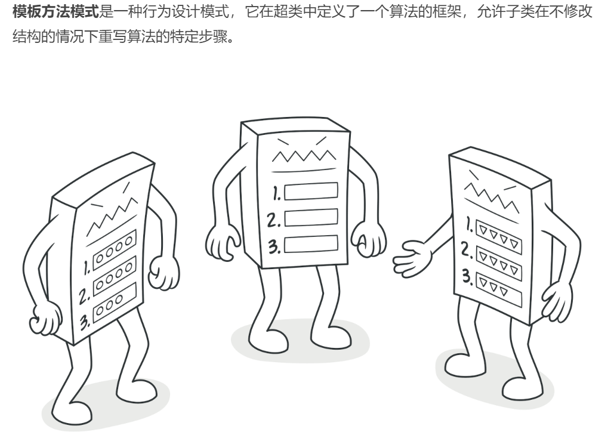
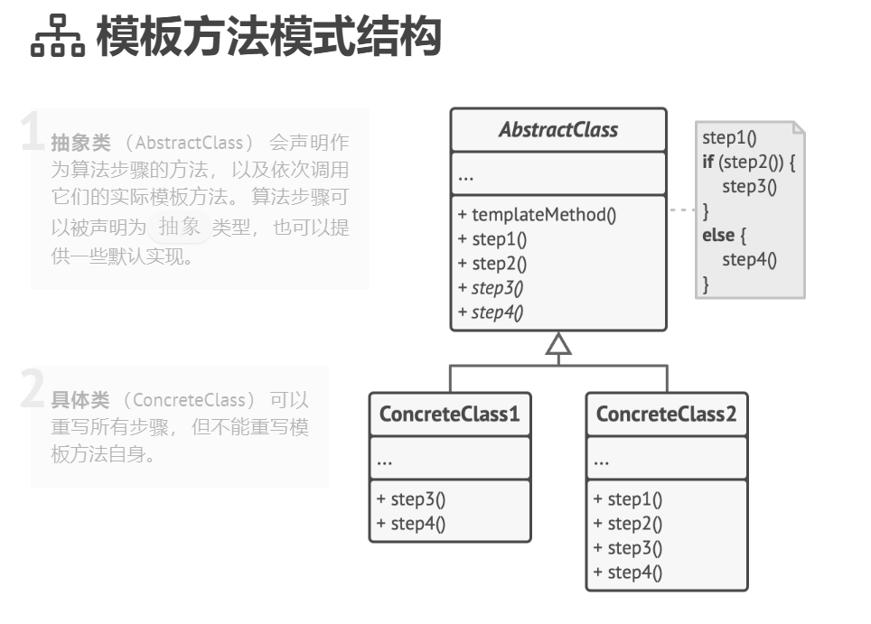

## 行为型模式（Behavioral Patterns）

### 模板方法模式（State Pattern）难度：2星

参考：https://refactoringguru.cn/design-patterns/template-method



模板方法模式：一个抽象类公开定义了执行它的方法的方式/模板。它的子类可以按需要重写方法实现，但调用将以抽象类中定义的方式进行

##### 使用场景：

就是一般的抽象类，定义了执行方法的模板，十分常见。

##### UML图：



##### 需求描述：

实现一个单板的初始化流程，有update、init、load

##### 模板方法模式：

```java
package behavioral_pattern.template_method;

/**
 * @author ：lindo-zy https://github.com/lindo-zy
 * 模板方法模式：实现一个单板的初始化流程，有update、init、load
 */
public class TemplateMethod {
    public static void main(String[] args) {
        Board board = new BaseBandBoard();
        board.loading();

    }

    static abstract class Board {

        /**
         * 单板更新版本
         */
        abstract void update();

        /**
         * 单板初始化
         */
        abstract void init();

        /**
         * 单板加载
         */
        abstract void load();

        /**
         * 基带板初始化
         */
        public final void loading() {
            update();
            init();
            load();
        }
    }


    static class BaseBandBoard extends Board {

        @Override
        void update() {
            System.out.println("基带单板版本更新！");
        }

        @Override
        void init() {
            System.out.println("基带单板初始化！");
        }

        @Override
        void load() {
            System.out.println("基带单板加载！");
        }
    }
}


```

#### 总结：

模板方法模式比较简单，容易掌握，在业务代码中应用很多，减少重复代码的编写，容易扩展和维护。

