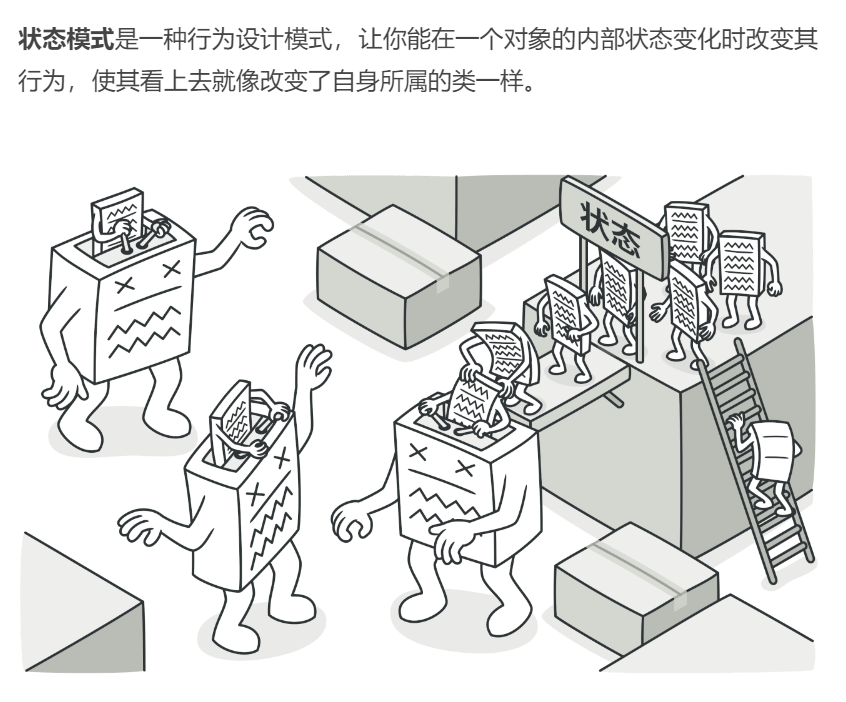
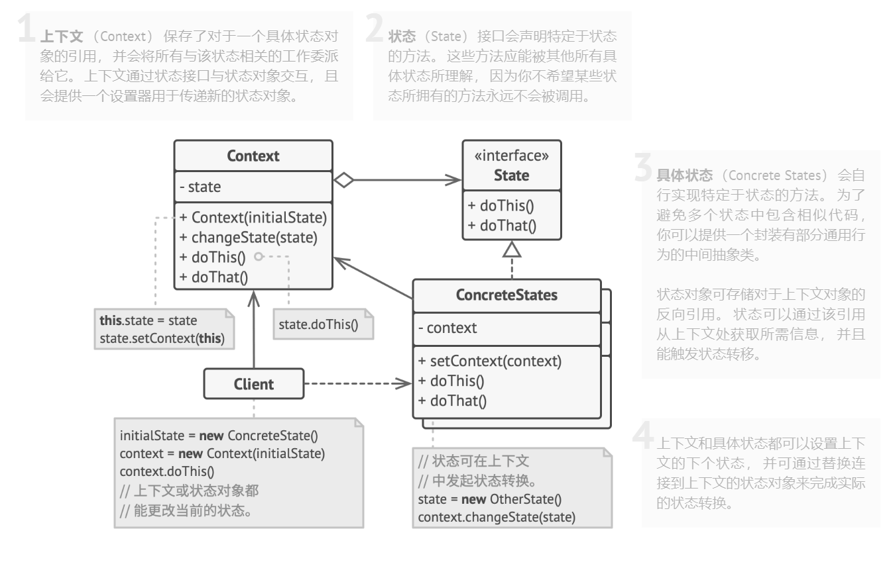

## 行为型模式（Behavioral Patterns）

### 状态模式（State Pattern）难度：3星

参考：https://refactoringguru.cn/design-patterns/state



状态模式： 类的行为是基于它的状态改变的。

##### 使用场景：

代码里面存在一个很长的`if else`列表，而这些分支都是因为不同状态下执行的操作不一样时考虑使用此模式。

##### UML图：



##### 需求描述：

实现一个简单的自动售货机状态变化：空闲状态、商品选中状态、已付费状态。

##### 状态模式：

```java
package behavioral_pattern.state;

/**
 * @author ：lindo-zy https://github.com/lindo-zy
 * 状态模式：实现一个简单的自动售货机状态变化：空闲状态、商品选中状态、已付费状态。
 */
public class StatePattern {
    public static void main(String[] args) {
        VendingMachine vm = new VendingMachine(3.5);
        vm.selectItem();
        vm.insertMoney(2);
        vm.insertMoney(1);
        vm.dispenseItem();

    }

    // 抽象状态类
    public interface VendingMachineState {
        void selectItem();

        void insertMoney(double money);

        void dispenseItem();
    }

    // 具体状态类：商品已被选中状态
    static class ItemSelectedState implements VendingMachineState {
        private VendingMachine vendingMachine;

        public ItemSelectedState(VendingMachine vendingMachine) {
            this.vendingMachine = vendingMachine;
        }

        @Override
        public void selectItem() {
            System.out.println("已经有商品被选中了，请先取消原来的选择！");
        }

        @Override
        public void insertMoney(double money) {
            if (money < vendingMachine.getItemPrice()) {
                System.out.println("金额不足，请继续投入硬币！");
            } else {
                vendingMachine.setMoney(money);
                vendingMachine.setState(new PaidState(vendingMachine));
            }
        }

        @Override
        public void dispenseItem() {
            System.out.println("请先投入足够的硬币！");
        }
    }

    // 具体状态类：已付费状态
    static class PaidState implements VendingMachineState {
        private VendingMachine vendingMachine;

        public PaidState(VendingMachine vendingMachine) {
            this.vendingMachine = vendingMachine;
        }

        @Override
        public void selectItem() {
            System.out.println("已经有商品被选中了！");
        }

        @Override
        public void insertMoney(double money) {
            System.out.println("您已经付过款了，无需再次投币！");
        }

        @Override
        public void dispenseItem() {
            vendingMachine.dispenseItem();
            if (vendingMachine.getMoney() == vendingMachine.getItemPrice()) {
                vendingMachine.setState(new IdleState(vendingMachine));
            } else {
                vendingMachine.setState(new ItemSelectedState(vendingMachine));
            }
        }
    }

    // 具体状态类：空闲状态
    static class IdleState implements VendingMachineState {
        private VendingMachine vendingMachine;

        public IdleState(VendingMachine vendingMachine) {
            this.vendingMachine = vendingMachine;
        }

        @Override
        public void selectItem() {
            System.out.println("请选择需要购买的商品！");
            vendingMachine.setState(new ItemSelectedState(vendingMachine));
        }

        @Override
        public void insertMoney(double money) {
            System.out.println("请先选择需要购买的商品！");
        }

        @Override
        public void dispenseItem() {
            System.out.println("请先选择需要购买的商品！");
        }
    }

    // 上下文类：自动售货机
    static class VendingMachine {
        private double itemPrice;
        private double money;
        private VendingMachineState state;

        public VendingMachine(double itemPrice) {
            this.itemPrice = itemPrice;
            this.money = 0;
            this.state = new IdleState(this);
        }

        public double getItemPrice() {
            return itemPrice;
        }

        public void setMoney(double money) {
            this.money = money;
        }

        public double getMoney() {
            return money;
        }

        public void setState(VendingMachineState state) {
            this.state = state;
        }

        public void selectItem() {
            System.out.println("请选择需要购买的商品！");
        }

        public void insertMoney(double money) {
            state.insertMoney(money);
        }

        public void dispenseItem() {
            System.out.printf("出售商品，找零 %.2f 元。\n", money - itemPrice);
            money = 0;
        }
    }
}

```

#### 总结：

状态模式将具体动作封装到了每个类中，需要增加具体动作时，添加一个类即可，减少了if-else的代码，便于扩展和修改，状态模式应用场景很多，但是把实际业务抽象成状态模式比较困难。

