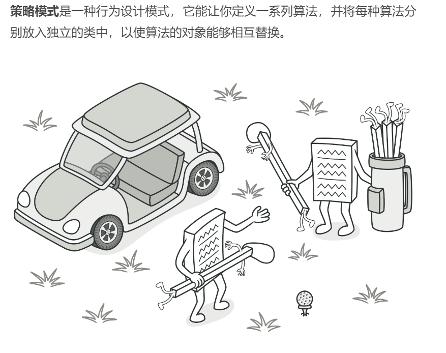
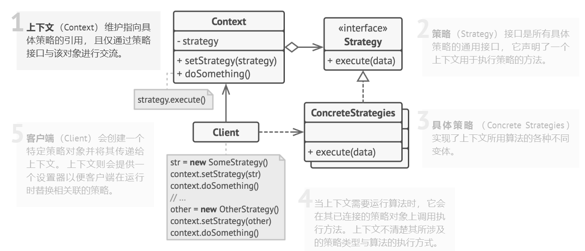

## 行为型模式（Behavioral Patterns）

### 策略模式（Strategy Pattern）难度：2星

参考：https://refactoringguru.cn/design-patterns/strategy



策略模式： 一个类的行为或其算法可以在运行时更改。定义一系列的算法,把它们一个个封装起来, 并且使它们可相互替换。

##### 使用场景：

高德地图有多种出行方式，就是典型的策略模式；当一个类的行为，根据不用分支确定用某种方法时，就可以用策略模式。

##### UML图：



##### 需求描述：

设计高德地图的步行、公共交通、自驾出行方法。

##### 备忘录模式：

```java
package behavioral_pattern.strategy;

/**
 * @author ：lindo-zy https://github.com/lindo-zy
 * 策略模式：设计高德地图的步行、公共交通、自驾出行方法。
 */
public class StrategyPattern {

    public static void main(String[] args) {
        GaoDeTravel gaoDeTravel = new GaoDeTravel();
        gaoDeTravel.chooseTravelStrategy("步行", "成都", "重庆");
        gaoDeTravel.chooseTravelStrategy("自驾", "成都", "重庆");
//        成都到重庆,步行需要4小时！
//        成都到重庆,自驾需要1小时！
    }

    /**
     * 出行策略接口
     */
    public interface TravelStrategy {
        /**
         * 计算出行时间
         *
         * @param src
         * @param dst
         * @return
         */
        void calculateTravelTime(String src, String dst);
    }

    /**
     * 步行策略
     */
    static class ByWalk implements TravelStrategy {

        @Override
        public void calculateTravelTime(String src, String dst) {
            System.out.println(src + "到" + dst + ",步行需要4小时！");
        }
    }

    /**
     * 公共交通策略
     */
    static class ByBus implements TravelStrategy {

        @Override
        public void calculateTravelTime(String src, String dst) {
            System.out.println(src + "到" + dst + ",公交需要2小时！");
        }
    }

    /**
     * 自驾策略
     */
    static class ByCar implements TravelStrategy {

        @Override
        public void calculateTravelTime(String src, String dst) {
            System.out.println(src + "到" + dst + ",自驾需要1小时！");
        }
    }

    static class GaoDeTravel {

        public void chooseTravelStrategy(String strategy, String src, String dst) {
            if ("步行".equals(strategy)) {
                ByWalk byWalk = new ByWalk();
                byWalk.calculateTravelTime(src, dst);
            } else if ("公交".equals(strategy)) {
                ByBus byBus = new ByBus();
                byBus.calculateTravelTime(src, dst);
            } else if ("自驾".equals(strategy)) {
                ByCar byCar = new ByCar();
                byCar.calculateTravelTime(src, dst);
            }

        }
    }
}

```

#### 总结：

策略模式的使用比较明确，一个类的行为根据选择有所变化，就采用策略模式，可以大大减少我们写if-else分支，添加新类也比较容易，使得代码的可维护和可扩展性好。

