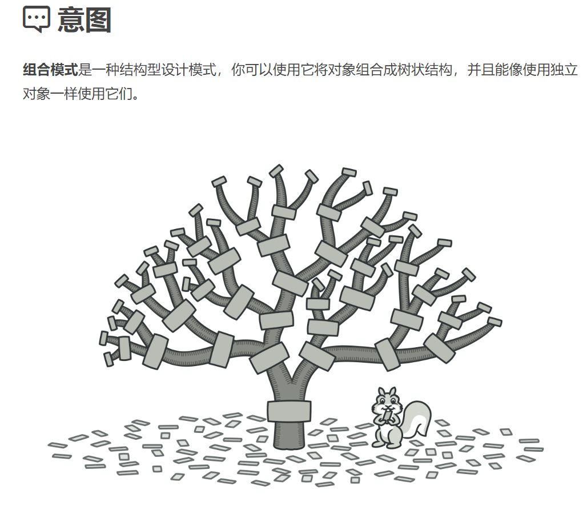
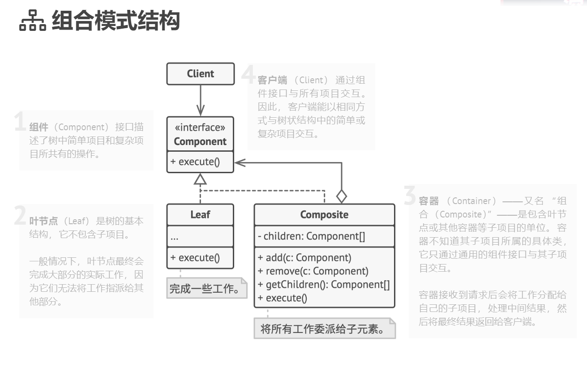

## 结构型模式（Structural Patterns）

### 组合模式（Composite Pattern）难度：3星

参考：https://refactoringguru.cn/design-patterns/composite



组合模式： 又叫部分整体模式，是用于把一组相似的对象当作一个单一的对象。组合模式依据树形结构来组合对象，用来表示部分以及整体层次。

##### 使用场景：

当程序结构有类似树一样的层级关系时，可以以统一的方式操作单个对象和由这些对象组合成的对象时，具有递归的操作方法。

##### UML图：



##### 需求描述：

公司下设多个部门，人事部门和IT部门，每个部门有一定人数，使用统一方法查询公司的总人数。

##### 组合模式：

```java

import java.util.ArrayList;
import java.util.List;

/**
 * @author ：lindo-zy https://github.com/lindo-zy
 * 组合模式：公司下设多个部门，人事部门和IT部门，每个部门有一定人数，使用统一方法查询公司的总人数。
 */
public class CompositePattern {
    public static void main(String[] args) {
        CompositeClient compositeClient = new CompositeClient();
        compositeClient.listOrgInfo();
    }

    /**
     * 抽象公司组织类
     */
    static abstract class OrganizationComponent {
        private String name;

        public OrganizationComponent(String name) {
            this.name = name;
        }

        public String getName() {
            return name;
        }

        /**
         * 添加组织
         *
         * @param organizationComponent
         */
        public abstract void add(OrganizationComponent organizationComponent);

        /**
         * 获取子节点
         *
         * @param orgName
         * @return
         */
        public abstract OrganizationComponent getChild(String orgName);

        /**
         * 获取部门人数
         *
         * @return
         */
        public abstract int getStaffCount();

        @Override
        public String toString() {
            return name;
        }


    }

    /**
     * 组合类-层级
     */
    static class OrganizationComposite extends OrganizationComponent {
        //组合模式核心
        private List<OrganizationComponent> organizationComponents = new ArrayList<>();

        public OrganizationComposite(String name) {
            super(name);
        }

        @Override
        public void add(OrganizationComponent organizationComponent) {
            organizationComponents.add(organizationComponent);
        }

        @Override
        public OrganizationComponent getChild(String orgName) {
            //递归思想
            for (OrganizationComponent org : organizationComponents) {
                OrganizationComponent targetOrg = org.getChild(orgName);
                if (targetOrg != null) {
                    return targetOrg;
                }
            }

            return null;
        }

        @Override
        public int getStaffCount() {
            int count = 0;
            for (OrganizationComponent org : organizationComponents) {
                count += org.getStaffCount();

            }
            return count;
        }
    }

    /**
     * 叶子类-不包含子类
     */
    static class ItDepartment extends OrganizationComponent {

        public ItDepartment(String name) {
            super(name);
        }

        @Override
        public void add(OrganizationComponent organizationComponent) {
            throw new UnsupportedOperationException(this.getName() + "已经是最基本部门，无法增加下属部门");
        }

        @Override
        public OrganizationComponent getChild(String orgName) {
            if (getName().equals(orgName)) {
                return this;
            }
            return null;
        }

        @Override
        public int getStaffCount() {
            return 20;
        }
    }

    static class HrDepartment extends OrganizationComponent {

        public HrDepartment(String name) {
            super(name);
        }

        @Override
        public void add(OrganizationComponent organizationComponent) {
            throw new UnsupportedOperationException(this.getName() + "已经是最基本部门，无法增加下属部门");

        }

        @Override
        public OrganizationComponent getChild(String orgName) {
            if (getName().equals(orgName)) {
                return this;
            }
            return null;
        }

        @Override
        public int getStaffCount() {
            return 40;
        }
    }

    /**
     * 客户端类
     */
    static class CompositeClient {

        /**
         * 创建公司组织
         *
         * @return
         */
        private OrganizationComponent createOrg() {
            //公司作为节点，挂载人事部门和IT部门
            OrganizationComposite head = new OrganizationComposite("总公司");
            HrDepartment hrDepartment = new HrDepartment("人事部门");
            ItDepartment itDepartment = new ItDepartment("It部门");
            head.add(hrDepartment);
            head.add(itDepartment);

            return head;
        }

        /**
         * 查询员工数
         */
        public void listOrgInfo() {
            OrganizationComponent organizationComponent = createOrg();
            System.out.println("员工总数：" + organizationComponent.getStaffCount());
        }
    }
}

```

#####      

#### 总结：

当需求具有层级关系时，如:树形菜单、文件夹管理这类需求，就可以先考虑使用组合模式。