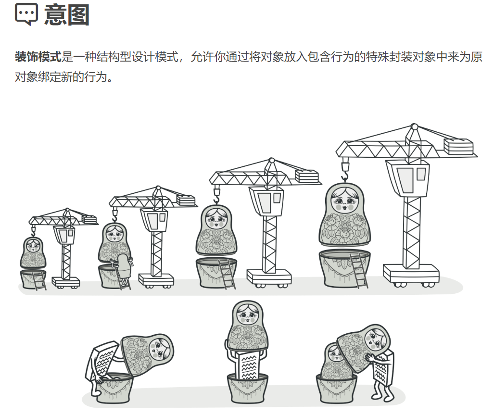
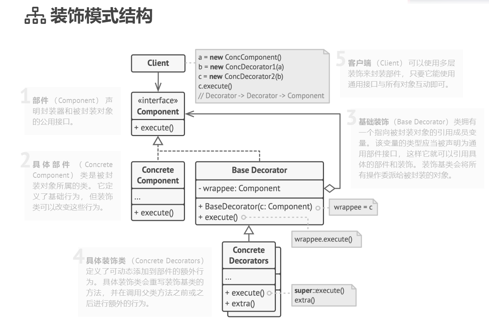

## 结构型模式（Structural Patterns）

### 装饰器模式（Decorator Pattern）难度：2星

参考：https://refactoringguru.cn/design-patterns/decorator



装饰器模式： 允许向一个现有的对象添加新的功能，同时又不改变其结构。是现有类的一个包装类，在不改变当前类的前提下，提供额外功能。

##### 使用场景：

需要给一个已有类添加新功能，但是又不影响原本的代码；需要动态给一个类扩展功能时，比如给函数添加函数计时器。

##### UML图：



##### 需求描述：

给一个函数，添加日志记录。

##### 装饰器模式：

```java

/**
 * @author ：lindo-zy https://github.com/lindo-zy
 * 装饰器模式:给一个函数，添加日志记录。
 */
public class DecoratorPattern {
    public static void main(String[] args) {
        Cal cal = new SimpleCal();
        CalFunctionTimeDecorator decorator = new CalFunctionTimeDecorator(cal);
        decorator.factorialUsingRecursion(1000);
    }

    /**
     * 计算接口
     */
    interface Cal {
        /**
         * 求阶层函数
         *
         * @param n
         */
        int factorialUsingRecursion(int n);
    }

    /**
     * 计算类
     */
    static class SimpleCal implements Cal {

        @Override
        public int factorialUsingRecursion(int n) {
            if (n <= 2) {
                return n;
            }
            return n * factorialUsingRecursion(n - 1);
        }
    }

    /**
     * 计算类函数装饰器
     */
    static abstract class Decorator implements Cal {
        protected Cal calFunction;

        public Decorator(Cal calFunction) {
            this.calFunction = calFunction;
        }

        @Override
        public int factorialUsingRecursion(int n) {
            return calFunction.factorialUsingRecursion(n);
        }
    }

    static class CalFunctionTimeDecorator extends Decorator {

        public CalFunctionTimeDecorator(Cal calFunction) {
            super(calFunction);
        }

        @Override
        public int factorialUsingRecursion(int n) {
            //此处添加装饰
            System.out.println("factorialUsingRecursion函数参数:" + n);
            return super.factorialUsingRecursion(n);
        }
    }
}

```

#####     

#### 总结：

装饰类和被装饰类可以独立发展，不会相互耦合，装饰模式是继承的一个替代模式，装饰模式可以动态扩展一个实现类的功能，是一个需要掌握的设计模式。