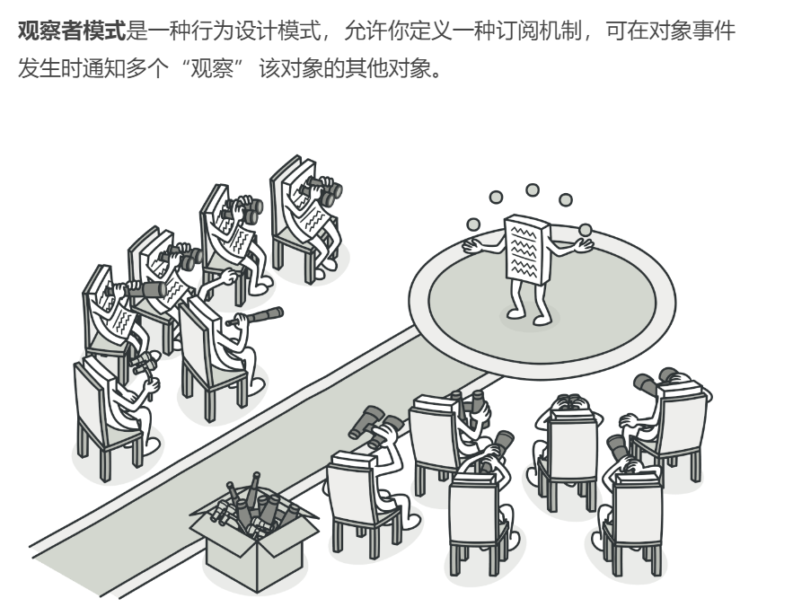
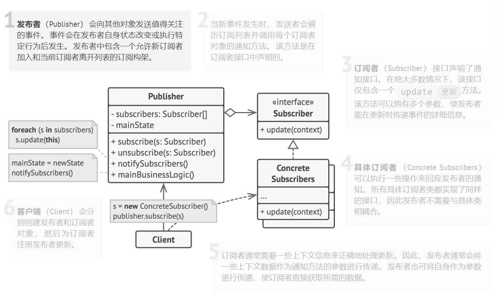

## 行为型模式（Behavioral Patterns）

### 观察者模式（Observer Pattern）难度：2星

参考：https://refactoringguru.cn/design-patterns/observer



观察者模式： 当对象间存在一对多关系时，比如，当一个对象被修改时，则会自动通知依赖它的对象。

##### 使用场景：

发布-订阅模式就是典型的观察者模式。

##### UML图：



##### 需求描述：

实现一个简单的消息队列的发布-订阅功能。

##### 观察者模式：

```java
package behavioral_pattern.observer;

import java.util.ArrayList;
import java.util.List;

/**
 * @author ：lindo-zy https://github.com/lindo-zy
 * 观察者模式：实现一个简单的消息队列的发布-订阅功能。
 */
public class ObserverPattern {
    public static void main(String[] args) {
        SimpleQueue simpleQueue = new SimpleQueue();
        Observer orderObserver = new OrderObserver();
        Observer shopObserver = new ShopObserver();
        //添加观察者
        simpleQueue.add(orderObserver);
        simpleQueue.add(shopObserver);

        simpleQueue.notifyState("订单：A");
        simpleQueue.notifyState("订单：B");
        simpleQueue.notifyState("商品：牛奶");
        simpleQueue.notifyState("商品：咖啡");
//        订单：A,开始处理！
//        订单：B,开始处理！
//        商品：牛奶,加入购物车！
//        商品：咖啡,加入购物车！
    }


    /**
     * 消息队列
     */
    public interface MessageQueue {
        /**
         * 添加观察者
         *
         * @param observer
         */
        void add(Observer observer);

        /**
         * 删除观察者
         *
         * @param observer
         */
        void remove(Observer observer);

        /**
         * 发布消息
         *
         * @param state
         */
        void notifyState(String state);
    }

    /**
     * 简单消息队列
     */
    static class SimpleQueue implements MessageQueue {
        private List<Observer> observers = new ArrayList<>();

        @Override
        public void add(Observer observer) {
            observers.add(observer);
        }

        @Override
        public void remove(Observer observer) {
            observers.remove(observer);
        }

        @Override
        public void notifyState(String state) {
            for (Observer observer : observers) {
                observer.update(state);
            }
        }
    }

    /**
     * 观察者接口
     */
    public interface Observer {
        /**
         * 订阅
         *
         * @param message
         */
        void update(String message);
    }

    /**
     * 订单观察者
     */
    static class OrderObserver implements Observer {

        @Override
        public void update(String message) {
            if (message.contains("订单")) {
                System.out.println(message + ",开始处理！");
            }
        }
    }


    /**
     * 购物车观察者
     */
    static class ShopObserver implements Observer {

        @Override
        public void update(String message) {
            if (message.contains("商品")) {
                System.out.println(message + ",加入购物车！");
            }
        }
    }
}

```

#### 总结：

观察者模式比较简单，使用范围很明确，当多个对象依赖某个对象的变化而要做出对应的改变时，就用这个设计模式。消息队列的发布-订阅模式就是观察者模式的应用。实际设计通知观察者的方式需要使用异步进行，避免某个观察者出现异常而阻塞系统。

