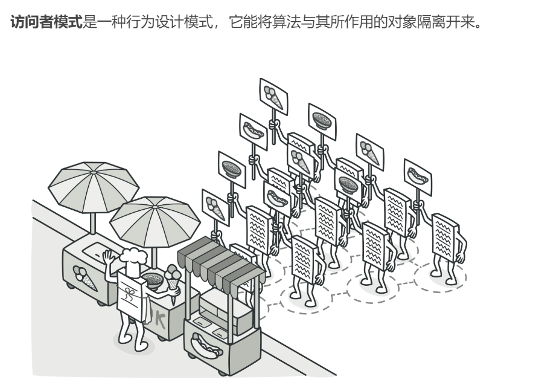
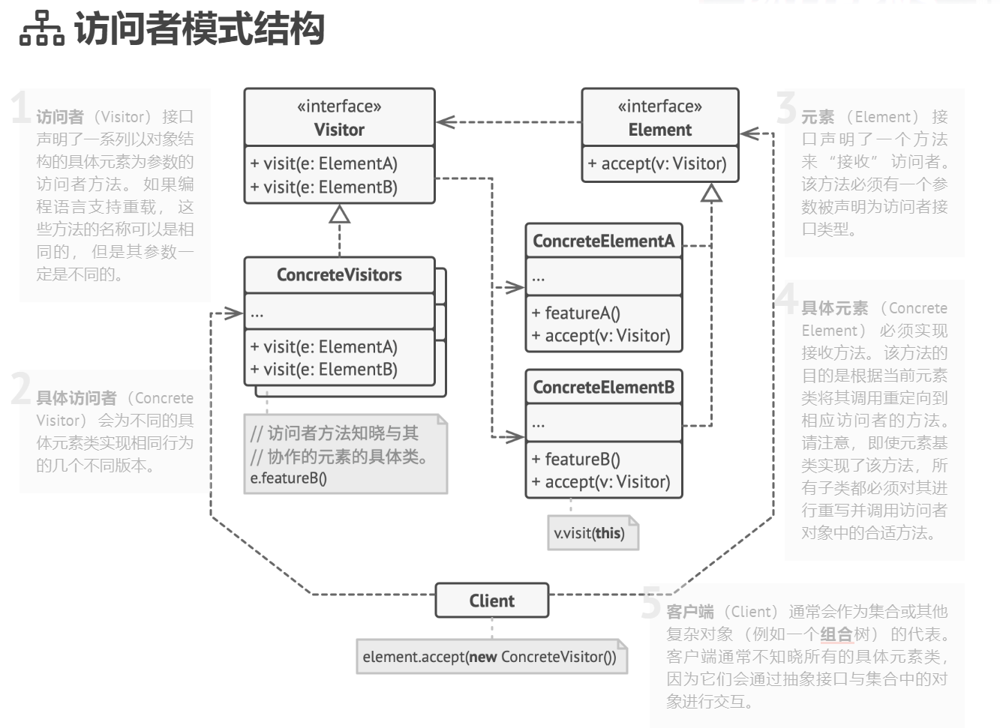

## 行为型模式（Behavioral Patterns）

### 访问者模式（State Pattern）难度：5星

参考：https://refactoringguru.cn/design-patterns/visitor



访问者模式：封装一些作用于某种数据结构中的各元素的操作，它可以在不改变这个数据结构的前提下定义作用于其内部各个元素的新操作。

##### 使用场景：

访问者可以对功能进行统一，可以做报表、UI、拦截器与过滤器。

##### UML图：



##### 需求描述：

不同访问者对同一个类，有不同的看法。

##### 访问者模式：

```java
package behavioral_patterns;

import java.math.BigDecimal;
import java.math.RoundingMode;
import java.util.ArrayList;
import java.util.List;

/**
 * @author poxiao
 * 访问者模式：不同访问者对同一个类，有不同的看法
 */
public class VisitorPattern {

    public static void main(String[] args) {
        DataView dataView = new DataView();

        dataView.show(new Parent());
        System.out.println("-----------------");
        dataView.show(new Principal());

    }

    interface Visitor {
        /**
         * @param student 访问学生信息
         */
        void visit(Student student);

        /**
         * @param teacher 访问老师信息
         */
        void visit(Teacher teacher);
    }

    /**
     * 抽象用户类
     * 稳定的结构
     */
    static abstract class User {
        public String name;
        public String identity;
        public String clazz;

        public User(String name, String identity, String clazz) {

            this.name = name;
            this.identity = identity;
            this.clazz = clazz;
        }

        /**
         * @param visitor 访问者接收方法
         */
        public abstract void accept(Visitor visitor);
    }

    static class Teacher extends User {

        public Teacher(String name, String identity, String clazz) {
            super(name, identity, clazz);
        }

        @Override
        public void accept(Visitor visitor) {
            visitor.visit(this);
        }

        // 升本率
        public double entranceRatio() {
            return BigDecimal.valueOf(Math.random() * 100).setScale(2, RoundingMode.HALF_UP).doubleValue();
        }
    }

    static class Student extends User {

        public Student(String name, String identity, String clazz) {
            super(name, identity, clazz);
        }

        @Override
        public void accept(Visitor visitor) {
            visitor.visit(this);
        }

        public int ranking() {
            return (int) (Math.random() * 100);
        }
    }

    static class Principal implements Visitor {

        @Override
        public void visit(Student student) {
            System.out.println("学生信息：" + student.name + ",班级：" + student.clazz);
        }

        @Override
        public void visit(Teacher teacher) {
            System.out.println("老师信息：" + teacher.name + ",班级升学率:" + teacher.entranceRatio());
        }
    }

    static class Parent implements Visitor {

        @Override
        public void visit(Student student) {
            System.out.println("学生信息:" + student.name + ",班级：" + student.clazz + "，排名：" + student.ranking());
        }

        @Override
        public void visit(Teacher teacher) {
            System.out.println("老师信息：" + teacher.name + ",职称" + teacher.identity);
        }
    }

    static class DataView {
        private List<User> userList = new ArrayList<>();

        public DataView() {
            userList.add(new Student("Alice", "重点班", "一年一班"));
            userList.add(new Student("Bob", "重点班", "一年一班"));
            userList.add(new Student("Ann", "普通班", "二年三班"));
            userList.add(new Student("Leo", "普通班", "三年四班"));
            userList.add(new Teacher("诸葛亮", "特级教师", "一年一班"));
            userList.add(new Teacher("刘备", "特级教师", "一年一班"));
            userList.add(new Teacher("张飞", "普通教师", "二年三班"));
            userList.add(new Teacher("关羽", "实习教师", "三年四班"));
        }

        public void show(Visitor visitor) {
            for (User user : userList) {
                user.accept(visitor);
            }
        }
    }
}

```

#### 总结：

访问者模式比较复杂，应用起来比较困难，一般在特定的场景可以考虑使用，如做报表这类需求，对类有一定侵入性。

