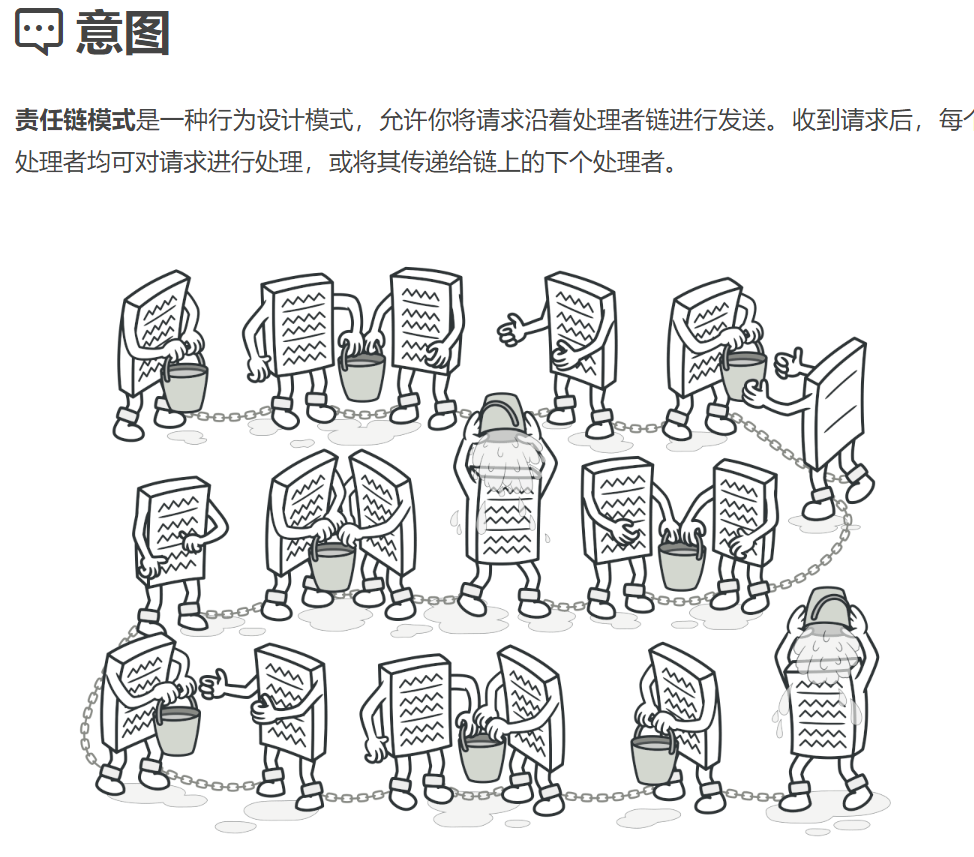
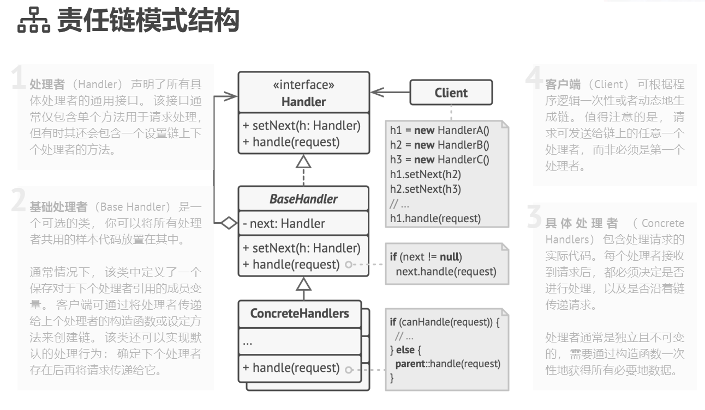

## 行为型模式（Behavioral Patterns）

### 责任链模式（Chain of Responsibility Pattern）难度：1星

参考：https://refactoringguru.cn/design-patterns/chain-of-responsibility



责任链模式： 每个接收者都包含对另一个接收者的引用。如果一个对象不能处理该请求，那么它会把相同的请求传给下一个接收者，依此类推。

##### 使用场景：

web框架中的拦截器；请假流程层层审批。

##### UML图：



##### 需求描述：

设计一个请假系统，员工请假需要从项目经理->人事经理->部长进行审核。

##### 责任链模式：

```java
/**
 * @author ：lindo-zy https://github.com/lindo-zy
 * //责任链模式：设计一个请假系统，员工请假需要从项目经理->人事经理->部长进行审核。
 */
public class ChainOfResponsibilityPattern {
    public static void main(String[] args) {
        Client client = new Client();
        //通过
        client.execute("李明", 3);
        //超过3天被拦截
        client.execute("张红", 4);

//        项目主管审核通过！:李明
//        人事经理审核通过：李明
//        部长审核通过：李明
//        项目主管审核通过！:张红
//        人事经理审核不通过：张红,请假不得超过3天
    }

    /**
     * 抽象处理类
     */
    static abstract class AbstractHandler {
        private AbstractHandler nextHandler;

        /**
         * 设置责任链
         *
         * @param nextHandler
         * @return
         */
        public AbstractHandler setNextHandler(AbstractHandler nextHandler) {
            this.nextHandler = nextHandler;
            return this.nextHandler;
        }

        /**
         * 获取下一个责任链
         *
         * @return
         */
        public AbstractHandler getNextHandler() {
            return this.nextHandler;
        }

        /**
         * 处理请求
         *
         * @param request
         * @param day
         */
        public abstract void handleRequest(String request, int day);
    }

    /**
     * 项目经理审核
     */
    static class ProjectManager extends AbstractHandler {

        @Override
        public void handleRequest(String request, int day) {
            System.out.println("项目主管审核通过！:" + request);
            if (getNextHandler() != null) {
                getNextHandler().handleRequest(request, day);
            }

        }
    }

    /**
     * 人事经理审核
     */
    static class PersonnelManager extends AbstractHandler {
        private static final int MAX_DAY = 3;

        @Override
        public void handleRequest(String request, int day) {
            if (day > MAX_DAY) {
                System.out.println("人事经理审核不通过：" + request + ",请假不得超过" + MAX_DAY + "天");
                return;
            }
            System.out.println("人事经理审核通过：" + request);
            if (getNextHandler() != null) {
                getNextHandler().handleRequest(request, day);
            }
        }
    }

    /**
     * 部长审核
     */
    static class DepartmentHead extends AbstractHandler {

        @Override
        public void handleRequest(String request, int day) {
            System.out.println("部长审核通过：" + request);
            if (getNextHandler() != null) {
                getNextHandler().handleRequest(request, day);
            }
        }
    }

    /**
     * 客户端
     */
    static class Client {
        private ProjectManager projectManager = new ProjectManager();
        private PersonnelManager personnelManager = new PersonnelManager();
        private DepartmentHead departmentHead = new DepartmentHead();

        public void execute(String request, int day) {
            projectManager.setNextHandler(personnelManager).setNextHandler(departmentHead);
            projectManager.handleRequest(request, day);
        }
    }
}

```

#### 总结：

责任链模式是一个比较简单的设计模式，需要掌握。一般在各种拦截器中就会看到，或者需要设计一个层层处理的流程，就可以考虑使用责任链模式。缺点是：系统性能会受影响，而且代码调试不太方便，设计不好甚至会造成循环调用。

