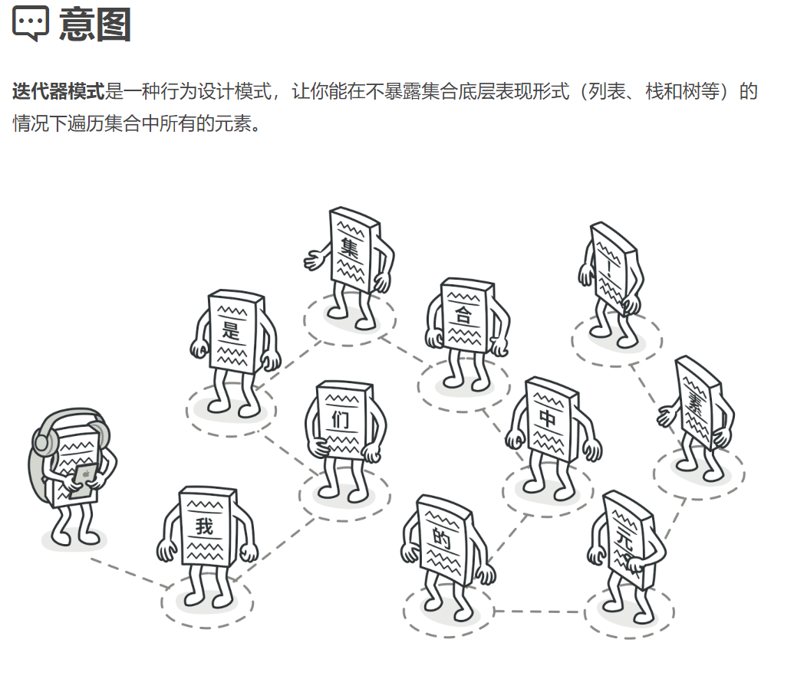
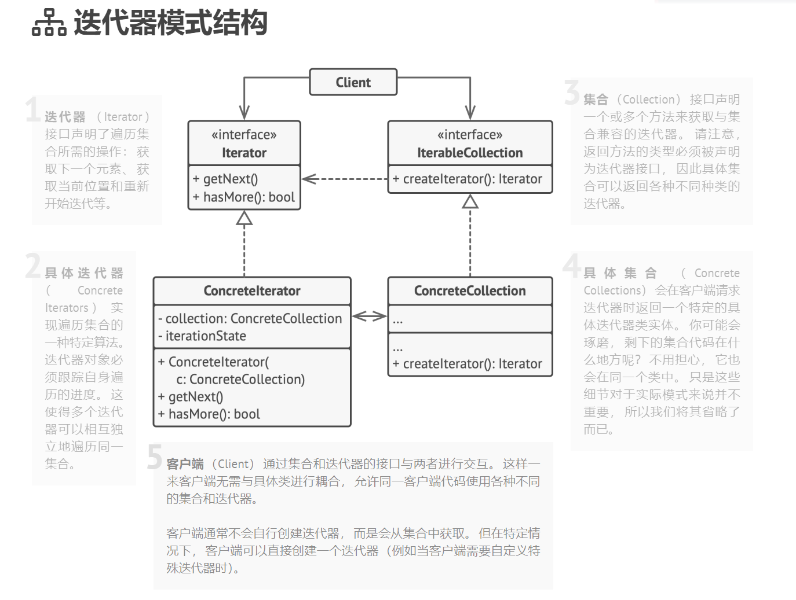

## 行为型模式（Behavioral Patterns）

### 迭代器模式（Iterator Pattern）难度：2星

参考：https://refactoringguru.cn/design-patterns/iterator



迭代器模式： 模式用于顺序访问集合对象的元素，不需要知道集合对象的底层表示。

##### 使用场景：

支持for循环的元素就是迭代器模式的应用。当一个类需要支持直接循环遍历时，就用迭代器模式。

##### UML图：



##### 需求描述：

实现一个可以进行for循环遍历的类。

##### 迭代器模式：

```java
/**
 * @author ：lindo-zy https://github.com/lindo-zy
 * //迭代器模式:实现一个可以for循环遍历的类。
 */
public class IteratorPattern {
    public static void main(String[] args) {
        Collection collection = new Collection();

        for (Iterator iterator = collection.getIterator(); iterator.hasNext(); ) {
            String name = (String) iterator.next();
            System.out.println("元素:" + name);
        }
        //        元素:Ann
        //        元素:Alice
        //        元素:Bob
        //        元素:Candy


    }

    /**
     * 迭代器接口
     */
    interface Iterator {
        /**
         * 判断是否可以继续迭代
         *
         * @return
         */
        public boolean hasNext();

        /**
         * 取下一个元素
         *
         * @return
         */
        public Object next();
    }

    /**
     * 迭代集合接口
     */
    interface IterableCollection {
        /**
         * 获取迭代器
         *
         * @return
         */
        Iterator getIterator();
    }

    /**
     * 集合类
     */
    static class Collection implements IterableCollection {
        public String[] names = {"Ann", "Alice", "Bob", "Candy"};

        @Override
        public Iterator getIterator() {
            return new CollectionIterator();
        }

        /**
         * 集合迭代器
         */
        private class CollectionIterator implements Iterator {
            int index;

            @Override
            public boolean hasNext() {
                return index < names.length;
            }

            @Override
            public Object next() {
                if (this.hasNext()) {
                    return names[index++];
                }
                return null;
            }
        }
    }
}

```

#### 总结：

迭代器是一个比较简单需要掌握的设计模式，访问一个聚合类不需要暴露内部结构，为聚合类提供了多种遍历方式，为不同的聚合结构提供了一个统一访问的接口。

