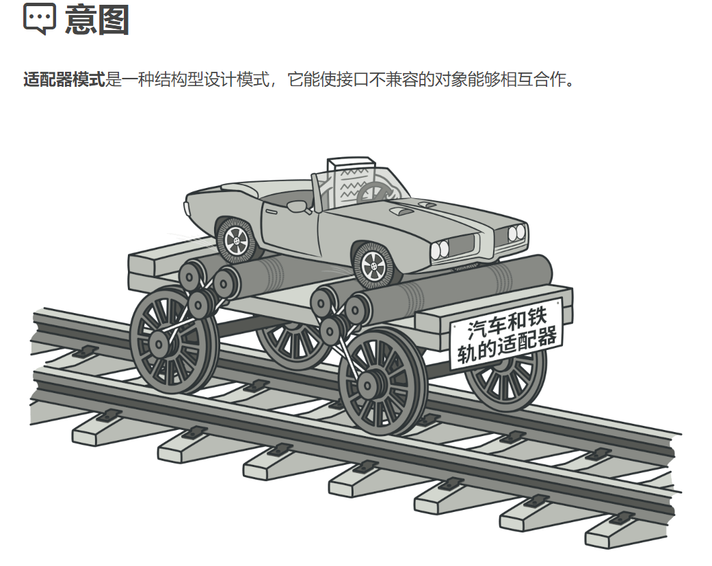
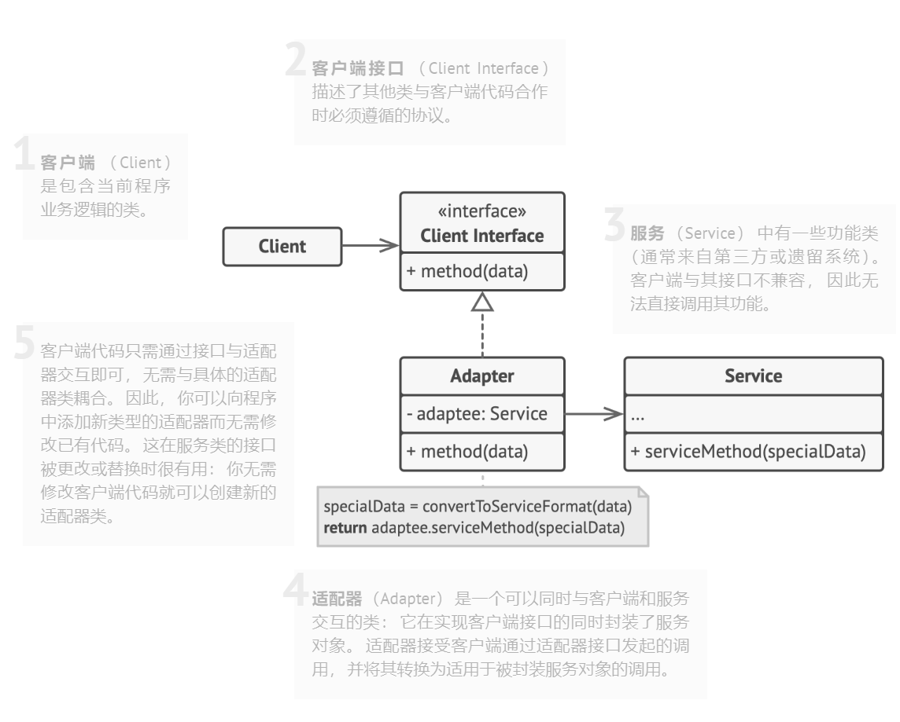

## 结构型模式（Structural Patterns）

### 适配器模式（Adapter Pattern）难度：1星

参考：https://refactoringguru.cn/design-patterns/adapter



适配器模式： 它能使接口不兼容的对象能够相互合作。

##### 使用场景：

一般是在需要修改老代码的时候与当前系统的接口不符合，但是不能直接修改老代码，需要增加一层适配的代码。

##### UML图：



##### 需求描述：

一个产品以前按加法计算，现在需要按平方计算。

##### 适配器模式：

```java
package structural_pattern.adapter;

/**
 * @author ：lindo-zy https://github.com/lindo-zy
 * 适配器模式
 */
public class AdapterPattern {
    public static void main(String[] args) {
        // 创建一个不兼容的对象
        Adaptee adaptee = new AdapteeImp();

        // 使用适配器进行适配
        Target target = new Adapter(adaptee);

        // 调用目标接口的方法，实际上会调用到适配器的方法
        target.add(2, 3);
    }


    /**
     * 目标接口
     */
    interface Target {

        /**
         * 计算方法
         *
         * @param x
         * @param y
         */
        void add(int x, int y);
    }


    /**
     * 不兼容的接口
     */
    interface Adaptee {

        /**
         * 平方计算
         *
         * @param a
         */
        void square(int a);

    }

    /**
     * 不兼容的接口实现
     */
    static class AdapteeImp implements Adaptee {


        @Override
        public void square(int a) {
            System.out.println(a * a);
        }
    }

    /**
     * 适配器
     */
    static class Adapter implements Target {

        private Adaptee adaptee;

        public Adapter(Adaptee adaptee) {
            this.adaptee = adaptee;
        }


        @Override
        public void add(int x, int y) {
            adaptee.square(x);
        }
    }
}

```

#### 总结：

平时代码开发用到很多，需要掌握的一种设计模式，简单易懂易上手。